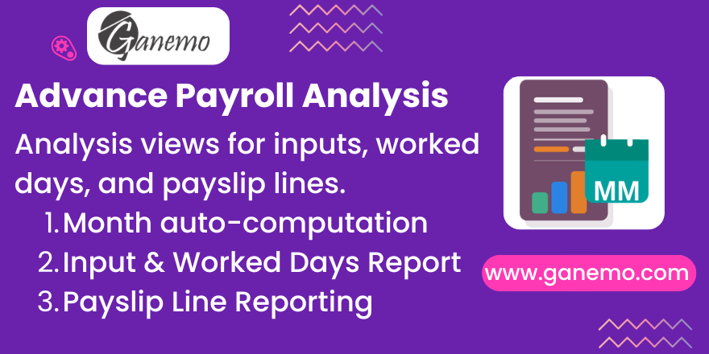

# **Payroll Fields**

## Overview

This module enhances Odoo Payroll by adding a computed **Payroll Month** field to payslips and creating dedicated analysis views for **Payslip Inputs**, **Worked Days**, and **Payslip Lines**. It introduces custom **Report Categories** to build flexible boardroom-ready pivot reports independent of traditional salary rules. It also injects **Quick Action buttons** directly into the Pay Run dashboard for lightning-fast mass editing. It provides better control for importing and analyzing payroll data.

## Features

### Payroll Month Auto-Detection

When a payslip spans two calendar months (e.g., January 25 – February 24), the module automatically determines which month the payslip belongs to by counting the number of days in each month. The month with the most days wins.

**Fields added to `hr.payslip`:**

| Field | Type | Description |
|---|---|---|
| `date_start_dt` | Date | Payroll Month (computed date) |
| `date_start` | Char | Month/Year in MM/YYYY format |
| `month` | Char | Two-digit month number (01-12) |
| `year` | Char | Four-digit year |
| `employee_category_ids` | Many2many | Employee Tags (related) |

### Payslip Input Analysis

Dedicated list, pivot, and graph views for **Payslip Inputs** (`hr.payslip.input`) with columns for employee, department, company, payroll month, structure, and amount.

**Menu:** Payroll > Reporting > Entry Analysis

### Worked Days Analysis

Independent analysis views for **Worked Days** (`hr.payslip.worked_days`) with number of days, hours, payroll month, and employee information.

**Menu:** Payroll > Reporting > Worked Days Analysis

### Payslip Line Analysis

Full analysis views for **Payslip Lines** (`hr.payslip.line`) with salary rule name, code, category, amount, payroll month, and department grouping.

**Menu:** Payroll > Reporting > Payroll Analysis

### Payslip Run Extension

The payroll batch (`hr.payslip.run`) also gets a computed **Payroll Month** field based on the batch date range.

### Custom Report Categories

Don't be limited by standard salary rule categories. This module introduces a new configuration model (`hr.salary.rule.report.category`) allowing you to create custom **Report Categories**. You can assign multiple salary rules to these categories to build dynamic, boardroom-ready financial Pivot reports grouped exactly how your executives need them.

### Pay Run Quick Actions

Accelerate your workflow with action buttons injected directly into the **Pay Run Kanban Card header**. From the 3-dots menu on any open Pay Run, you can instantly:
- **Edit Inputs:** Opens a mass-editable list of all temporary inputs for that specific batch.
- **Edit Worked Days:** Opens a flat list of all worked days for the batch.
- **Report by Rules:** Automatically generates a Pivot view of payslip lines grouped by standard Rules.
- **Report by Categories:** Automatically generates a Pivot view grouped by your Custom Report Categories.

### Employee Enhancements

Adds a `disability` boolean to employee records (via `hr.version`), useful for payroll rules requiring special deductions or benefits.
Also adds an `advance_percent` float field (Max Advance %) under the HR Settings tab to configure the maximum allowable payroll advance percentage per employee.

## Configuration

No special configuration is required. Simply install the module and:

1. **Payroll Month** fields will be automatically computed on all existing and new payslips based on their `Date From` and `Date To`.
2. **Analysis menus** will appear under **Payroll > Reporting**.
3. A **"Last 6 months"** filter is dynamically injected in search views for quick period filtering.

## Dependencies

- `hr_payroll` (Odoo Enterprise)

## Compatibility

- **Odoo 19** (Enterprise)
- Supported on: **Odoo.SH**, **Ganemo Online**, **Ganemo.SH**
- **Not supported** on Odoo Online (due to custom code restrictions)

## Multi-Language Support

This module includes translations for:
- 🇺🇸 English (en_US)
- 🇪🇸 Spanish (es_ES, es_PE, es_MX)

## License

This module is licensed under **OPL-1** (Odoo Proprietary License v1.0).
See [LICENSE.txt](LICENSE.txt) for details.

## **Author**: [Ganemo](https://www.ganemo.co)
