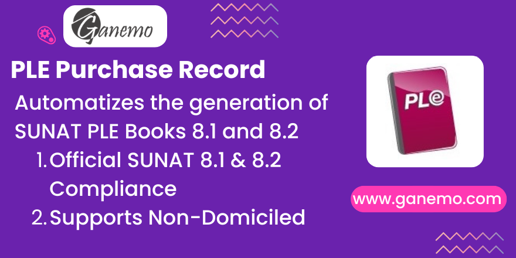

# Electronic Purchase Record

**Author**: [Ganemo](https://www.ganemo.com)

## Description
This module automatically generates the Electronic Purchase Record (Registro de Compras) in TXT format, strictly complying with **SUNAT Resolution 8.1 (General Purchase Register)** and **8.2 (Non-Domiciled Operations)**.

It is designed to integrate seamlessly with Odoo 19's native accounting, pulling data directly from Vendor Bills, Payments, and Tax configurations to populate the PLE structures without manual intervention.

## Key Features
- **Automatic TXT Generation**: One-click generation of 8.1 and 8.2 formats.
- **Non-Domiciled Support**: Full handling of "No Domiciliado" operations, including Importation of Services and digital services.
- **Detractions & Retentions**: Correctly maps Spot (Detraction) payments and dates to the required columns.
- **Multi-Currency**: Handles exchange rates natively using Odoo's rate tables.
- **Validation**: Includes basic data validation to prevent common errors before submission.

## Configuration

### 1. Company Setup
Ensure your Company is configured with the **Peru** localization.
- Go to **Settings > Companies**.
- Verify **Country** is "Peru".
- Ensure the **RUC** is valid (11 digits).

### 2. Document Types
The module uses `l10n_latam_document_type`.
- Go to **Accounting > Configuration > Document Types**.
- Ensure standard codes (01, 03, 07, 08) are active.
- For Non-Domiciled, ensure code **91** (Comprobante de No Domiciliado) is available.

### 3. Taxes
Ensure your Taxes are correctly tagged with PLE codes.
- The module looks for standard Peruvian taxes (IGV, Renta).
- Custom taxes for Non-Domiciled retention (30%) should be configured if using Format 8.2.

## Usage

### Generating the PLE
1.  Navigate to **Accounting > Reporting > Peru PLE > Purchase Book**.
2.  Select the **Fiscal Year** and **Month**.
3.  Click **Generate**.
4.  The system will create the TXT files as attachments. Download them.
5.  Load the files into the **SUNAT PLE Application** to validate.

### Recording Non-Domiciled Bills (Format 8.2)
1.  Create a Vendor Bill for a supplier whose Country is **NOT** Peru.
2.  The system will automatically detect the foreign status.
3.  Select the **Document Type** (e.g., 91 - Comprobante de No Domiciliado).
4.  Apply the corresponding Taxes (e.g., IGV Importation or Retention).
5.  Post the bill. This record will appear exclusively in the **8.2 TXT**.

## Troubleshooting
- **Missing Invoices**: Check the Invoice Date. It must fall within the selected reporting period.
- **Validation Errors**: Use the SUNAT Validator to identify specific row errors (usually missing RUCs or incorrect Currency formats).

## Data Mapping Logic
### Serie & Correlative (Columns 7 & 9)
The module uses specific fallback logic to populate the "Serie" and "Número" (Correlative) fields in the PLE TXT info.

**Priority of Fields:**
1.  `l10n_latam_document_number` (Official Document Number)
2.  `ref` (Vendor Bill Reference)
3.  `name` (Odoo Internal Sequence)

**Splitting Logic:**
-   **Serie (Col 7):** Takes the text **before** the first hyphen (`-`). Defaults to `0000` if no hyphen is found.
-   **Número (Col 9):** Takes the text **after** the first hyphen. Uses the full content if no hyphen is found.

## Credits
**Author**: [Ganemo](https://www.ganemo.com)
