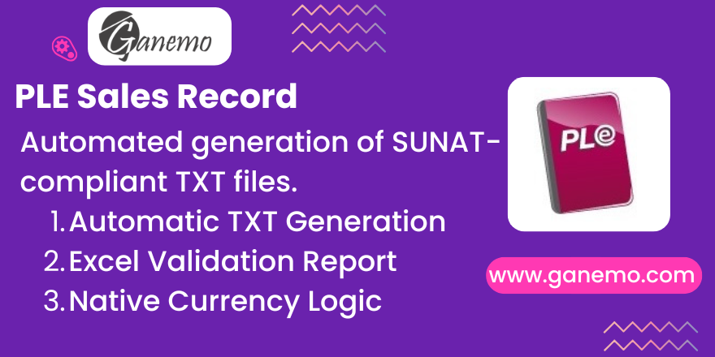

# PLE Sales Record (Electronic Books)

**Author**: [Ganemo](https://www.ganemo.co)

## Overview
This module facilitates the generation of the Peruvian Electronic Sales Record (PLE) compliant with SUNAT regulations. It generates the required `.txt` files for the PLE/SIRE software and provides an Excel helper for auditing purposes. It fully supports Odoo 19 and handles multi-currency transactions with automatic exchange rate inversion logic required by SUNAT.

## Features
- **TXT Generation**: Creates the `LE...txt` files with the exact structure required by SUNAT.
- **Excel Audit Report**: Generates a readable Excel file to verify amounts, taxes, and exchange rates before declaration.
- **Currency Handling**: Automatically calculates the inverted exchange rate (1/rate) for PLE reporting, as Odoo stores indirect rates but SUNAT requires direct rates.
- **Localization Support**: Integrates with `l10n_pe` and native Odoo accounting.
- **Multi-Company**: Fully supports multi-company environments with country-specific filtering.

## Configuration
1. **Install Module**: Ensure `ple_sale_book` is installed.
2. **Setup Journal**: Go to *Accounting > Configuration > Journals*. Ensure your Sales journals are correctly configured with the appropriate "PLE Type" if applicable.
3. **Verify Currencies**: Go to *Accounting > Configuration > Currencies*. Ensure USD and PEN are active and rates are current.
4. **Company Country**: Ensure your Company's country is set to "Peru" for the PLE menus to appear.
5. **Tax Configuration (Critical)**:
   To map your amounts to the correct PLE columns, you must use the **PLE Sale Tax Rules** wizard:
   - Go to *Accounting > Configuration > PLE > Sale Tax Rules*
   - Select your rules (e.g. IGV 18%, Exonerated)
   - Click *Action > Update Tags*
   - The system will auto-assign the correct tags (e.g. `S_BASE_OG`, `S_TAX_OG`) to your taxes.

## Usage
1. Go to **Accounting > Reporting > PLE Sales**.
2. Click **Create**.
3. Select the **Company**, **Date Start**, and **Date End** (usually the first and last day of the month).
4. Click **Generate Report**.
   > **Note**: Invoices marked as **"PLE Declared"** (from previous runs) are automatically excluded to prevent duplication.
5. The system will process the invoices for the period.
   - **TXT Report**: Download this file to upload to the PLE/SIRE software.
   - **Excel Report**: Download this file to verify the data.
6. **Verify Exchange Rates**: For USD invoices, the report will show the inverted rate (e.g., if Odoo rate is 0.25, Report shows 4.000).
7. Once declared to SUNAT, you can leave the record in the "Generated" state or move to "Declared".

## Report Column Mapping (Data Sources)
| # | PLE Column | Logic / Source | Odoo Field |
|---|---|---|---|
| 1 | Periodo | YYYYMM00 format from Accounting Date | `am.date` |
| 2 | CUO | Operation Unique Code | `am.name` (cleaned) |
| 3 | Correlativo | M-0000X or M-RER | `ple_correlative` |
| 4 | F. Emisión | Invoice Issue Date | `am.invoice_date` |
| 5 | F. Vencimiento | Due Date (If Doc Type 14) | `am.invoice_date_due` |
| 6 | Tipo Doc. | SUNAT Code (01, 03, 07, 08) | `l10n_latam_document_type_id` |
| 7 | Serie | Series from Name | `am.name` (split) |
| 8 | Número | Number from Name | `am.name` (split) |
| 10 | T. Doc. Cliente | VAT Code (6=RUC, 1=DNI) | `l10n_latam_identification_type_id` |
| 11 | N. Doc. Cliente | Customer VAT Number | `partner_id.vat` |
| 12 | Razón Social | Customer Name | `partner_id.name` |
| 13 | Valor Exp. | Export Base | Tag: `S_BASE_EXP` |
| 14 | Base Imp. | Taxable Base | Tag: `S_BASE_OG` |
| 16 | IGV / IPM | Tax Amount (18%) | Tag: `S_TAX_OG` |
| 18 | Exonerado | Exonerated Base | Tag: `S_BASE_OE` |
| 19 | Inafecto | Unaffected Base | Tag: `S_BASE_OU` |
| 20 | ISC | ISC Amount | Tag: `S_TAX_ISC` |
| 21 | Base IVAP | Rice Tax Base | Tag: `S_BASE_IVAP` |
| 22 | IVAP | Rice Tax Amount | Tag: `S_TAX_IVAP` |
| 23 | ICBP | Plastic Bag Tax | Tag: `S_TAX_ICBP` |
| 25 | Importe Total | Document Total | `amount_total` |
| 26 | Moneda | Currency Code | `currency_id.name` |
| 27 | T. Cambio | 1 / Rate (if USD) | `1 / invoice_currency_rate` |
| 28 | F. Ref. Origin | Origin Date | `origin_invoice_date` |
| 29 | T. Ref. Origin | Origin Doc Type | `origin_document_code` |
| 30 | S. Ref. Origin | Origin Series | `origin_number` |
| 31 | N. Ref. Origin | Origin Number | `origin_number` |
| 34 | Estado PLE | 1 (Active), 2 (Voided) | `ple_state` |

## Technical Notes
- **Exchange Rate**: The module uses `invoice_currency_rate` from `account.move`. If the invoice is in foreign currency (e.g., USD), the rate reported to PLE is `1 / invoice_currency_rate` rounded to 3 decimal places.
- **Dependencies**: Requires `l10n_country_filter`, `account_origin_invoice`, and `dua_in_invoice`.