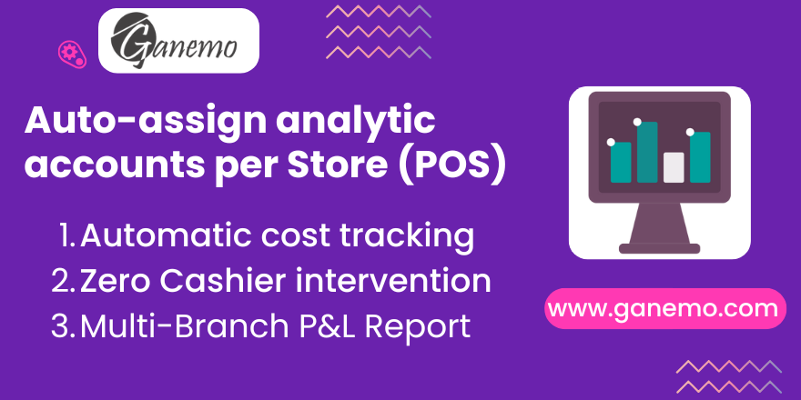

# POS Analytic Default Location

**Odoo Version**: 19.0

## Summary
Link POS Config to Analytic Distribution Models.

## Overview
This module bridges the gap between Point of Sale and Odoo's Analytic Accounting. It extends the **Analytic Distribution Models** to include a **Point of Sale** criterion.

This allows businesses to automatically assign specific analytic accounts (cost centers, projects, or dimensions) to all financial entries generated by a specific POS terminal or shop, without requiring any manual intervention from the cashier.

## Features
- **POS-based Analytic Rules**: Define analytic distribution rules matched by the POS Configuration.
- **Session Closing Support**: Robust integration that ensures analytic accounts are assigned to aggregated session moves and closing journal entries.
- **Context Injection**: Automatically injects `pos_config_id` into the context during session validation and invoice generation to trigger analytic rules.
- **Multi-Branch Support**: Perfect for retail chains that need to track Profit & Loss per physical store.
- **Odoo 19 Merging**: Seamlessly combines with other analytic rules (like account prefixes or products) on the same transaction line.

## Installation
1. Install the module normally from the Odoo Apps menu.
2. Dependencies: `point_of_sale`, `stock_account`, `sale_stock`, and `account_analytic_default_location`.

## Configuration
1. Go to **Accounting > Configuration > Analytic Accounting > Analytic Distribution Models**.
2. Create a new rule.
3. In the **Point of Sale** field (added by this module), select the POS configuration.
4. Set the desired **Analytic Distribution**.

## Usage
No daily usage is required. Once configured:
1. Cashiers open and close POS sessions as usual.
2. When the session is posted or an invoice is generated, the system automatically finds the matching rule.
3. Journal items are created with the correct Analytic Account pre-filled.

## Credits

**Author**: [Ganemo](https://www.ganemo.co)

## License
OPL-1
