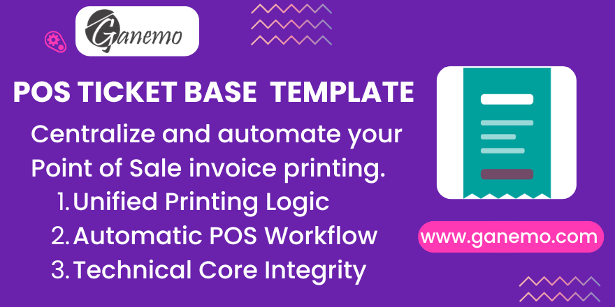

# **POS Ticket Base Template**

## **Overview**
This module is a technical base designed to centralize and automate the overwriting of Point of Sale (POS) functionalities related to invoice management. It provides a standardized framework for automatic printing and downloading of electronic invoices, ensuring a seamless experience for both cashiers and customers.

By centralizing these triggers, the module prevents conflicts between multiple localized or custom POS extensions, making it an essential component for complex POS environments in Odoo 19.

---

## **Key Features**
- **Unified Printing Logic**: Avoids duplication of printing triggers across custom modules.
- **Automatic Invoice Printing**: Instant print dialog popup using the integrated `print.js` library.
- **Automatic Invoice Download**: Triggers a direct PDF download of the generated invoice upon validation.
- **Exclusivity Control**: Intelligently manages the toggle between native ticket printing and electronic invoice printing to avoid paper waste.
- **Developer-Friendly Core**: Uses modern Odoo 19 patterns (`_load_pos_data_fields`, `PosStore` services) for high stability.

---

## **Configuration & Setup**

### **1. Activation**
1. Open the **Point of Sale** app.
2. Go to **Configuration > Settings**.
3. Select the POS store you want to configure.
4. Locate the **Receipt & Invoices** section.

### **2. Automation Settings**
- **Automatic Electronic Invoice Printing**: Check this box to enable the automatic print dialog for invoices. 
- **Automatic Electronic Invoice Download**: Check this box to automatically save a PDF copy of the invoice to the local device.

> **Note**: If you enable *Automatic Electronic Invoice Printing*, the system will automatically disable the native *Automatic Receipt Printing* to ensure that only the formal invoice is processed, preventing the printer from outputting two documents for the same sale.

---

## **Usage Instructions**

1. Start a new **POS Session**.
2. Process a normal sale and select a **Customer**.
3. In the **Payment Screen**, ensure the **Invoice** button is activated (highlighted).
4. Complete the payment and click **Validate**.
5. The system will automatically:
   - Launch the print dialog (if configured).
   - Initiate the PDF download (if configured).

---

## **Technical Details**
- **Framework**: Fully compatible with Odoo 19 and the Owl Component System.
- **Libraries**: Includes a lightweight version of `print.js` to handle Base64 PDF printing without external dependencies.
- **Data Model**: Extends `pos.order` and `pos.config` to handle the new automation flags and ensure the `account_move` data is ready for the frontend.

---

## **Credits**
**Author**: [Ganemo](https://www.ganemo.com)

---
© 2026 Ganemo. All rights reserved.
