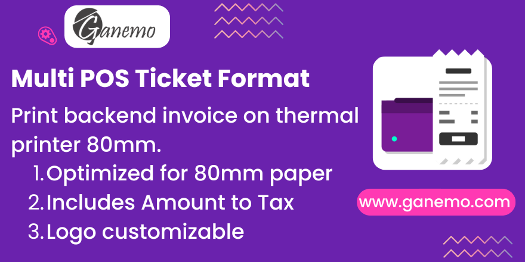

# POS Ticket Format Invoice

## Description
This module creates a new Ticket Type Format to use in printing the Invoice. In this way, thermal printers can be used to print backend invoices.

## Features
-   Generates a ticket format report for invoices.
-   Supports thermal printers (e.g., 80mm).
-   Includes support for "Amount to Text" conversion.
-   Displays company logo, address, and additional information.
-   Shows customer details and document types.
-   Configurable point of emission address per journal.

## Dependencies
-   account
-   l10n_latam_invoice_document
-   account_invoice_extras
-   amount_to_text_invoice
-   base_address_extended
-   l10n_latam_base

## Usage
1.  Go to **Invoices**.
2.  Open an invoice.
3.  Click on **Print** -> **Invoice Ticket**.

## Configuration
To set a specific address for the point of emission:
1.  Go to **Accounting** -> **Configuration** -> **Journals**.
2.  Select a Sales Journal (e.g., POS Journal).
3.  Go to the **Advanced Settings** tab.
4.  Set the **Point of Emission Address**.

## Author
**Author**: [Ganemo](https://www.ganemo.co)
