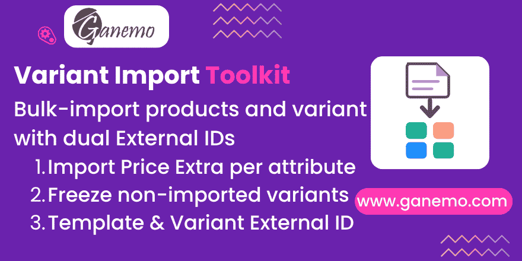

**Product Variant Import Toolkit**



Bulk-import products and their variants in Odoo 19 from a single file. This module
wraps Odoo 19's **native** variant importer (the `import_attribute_values` /
"Product Values" pseudo-field) and fills the gaps the core leaves out. Every
behaviour was validated live against a 19.0 database, and the module ships with a
green automated test suite.

**Author**: [Ganemo](https://www.ganemo.com)

---

## Why this module

Odoo 19 can import variants natively, but three real needs are unmet:

1. It assigns an External ID only to the **variant**, not to the **template** (the
   template one requires a separate, error-prone two-pass import).
2. If a variant for a combination already exists (even archived, even one Odoo
   auto-generated without an External ID), a plain import **fails** with a
   duplicate-combination database error.
3. There is no way to import `price_extra`, and no automated way to keep
   non-imported combinations from reappearing.

This toolkit solves all three, without ever touching the fragile native import
code: it is a guided wizard that orchestrates the native importer plus a few
safe pre/post steps.

## Installation

1. Copy `product_variant_import_toolkit` into your addons path.
2. Update the Apps list and install **Product Variant Import Toolkit**
   (technical name `product_variant_import_toolkit`). It depends on `stock`.

## How to use

Go to **Inventory → Products → Variant Import Toolkit**, upload a CSV, choose the
options, and click **Import**. A report is shown on screen.

### CSV format

Only `name` and `import_attribute_values` are required. All other columns are
optional.

| Column | Meaning |
|---|---|
| `name` | Product template name. Rows sharing a name belong to the same template. |
| `import_attribute_values` | Combination as `Attribute:Value,Attribute2:Value2`. Attributes/values are created if missing and reused if present. The value is resolved **scoped to the template**, so values with the same name on different products never cross. |
| `id` | Your External ID for the **variant** (`module.name`; without a dot the *Module Prefix* is applied). |
| `template_id` | Your External ID for the **template** (requires *External ID for templates*). |
| `price_extra:<Attribute>` | Extra price to set on the **attribute value** of that row (e.g. `price_extra:Color` on a "Red" row sets the extra price of "Red"). |
| any product field | `default_code`, `barcode`, `standard_price`, `list_price`, `categ_id`, `is_storable`, `weight`, `volume`... passed through to the native import. |

Example:

```csv
id,template_id,name,import_attribute_values,default_code,barcode,list_price,standard_price,categ_id,is_storable,price_extra:Color
ganemo.var_polo_s_red,ganemo.tmpl_polo,Polo,"Size:S,Color:Red",POLO-S-R,7750000000011,49.90,22.00,Goods,True,0
ganemo.var_polo_m_blue,ganemo.tmpl_polo,Polo,"Size:M,Color:Blue",POLO-M-B,7750000000028,49.90,23.50,Goods,True,3
```

### Options

| Option | Effect |
|---|---|
| **External ID for templates** | Creates the template's External ID from `template_id`. Never overwrites an existing External ID. |
| **Claim existing variants** | If the combination already exists (even archived, even without an External ID), reactivate it, write the row's data and bind your External ID — instead of failing on a duplicate combination. |
| **Freeze non-imported combinations** | Adds native attribute exclusions so combinations absent from the file are not auto-generated later. |
| **Module Prefix** | Module used for External IDs written without a dot. |

## Behaviour you should know (verified)

- **No cartesian explosion.** Only the variants listed are created; the native
  mechanism runs with `create_product_product=False`.
- **Partial unique index.** Combination uniqueness applies only to *active*
  variants (`WHERE active IS TRUE`), which is why *Claim* reactivates the existing
  variant instead of creating a duplicate.
- **`standard_price` is per company.** Select the correct company before
  importing.
- **`price_extra` is per attribute value**, not per variant (Odoo's own model).
  For an arbitrary per-variant price, use a pricelist on the variant.
- **Root category is "Goods"** in Odoo 19 (not "All"). Use an existing category
  name, or `categ_id/id` with an External ID.
- **Idempotent.** Re-importing with the same `id` updates in place; changing the
  combination of an existing `id` is rejected by Odoo's guardian.
- **Freeze is pairwise.** With 3+ attributes some combinations cannot be isolated
  by pairs; those are **reported**, never silently dropped. Pair the toolkit with
  *Variant Archive Lock* for those cases.

## Compatibility

Odoo 19 — Community and Enterprise (Odoo.SH, Ganemo Online). English and Spanish
included.

## Support

- Sales: leads@ganemo.com
- Help desk: ayuda@ganemo.com
