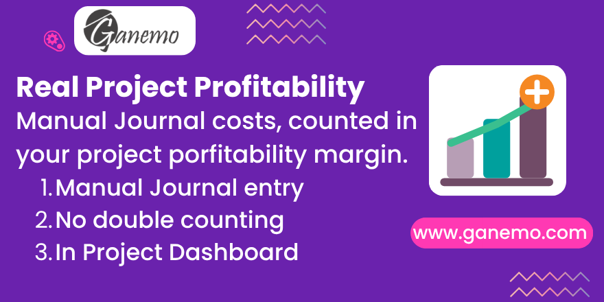

# **Project Profitability - Journal Entries**

Include costs and revenues posted through **manual journal entries** on the
project's analytic account in the **profitability panel**, with no double
counting. Odoo 19.

**Author**: [Ganemo](https://www.ganemo.com)

---

## What it does

The project profitability panel only accounts for what reaches the project
through a **recognised document**: customer invoices, vendor bills / purchase
orders, and (when installed) timesheet analytic items. A cost posted with a
plain **manual journal entry** on the project's analytic account is shown in the
**Analytic Items** list but never reaches the project margin.

This module adds those manual journal entries to the panel. On the project's
analytic account it reads the analytic items that come from a **posted journal
entry** (move type *"Journal Entry"*) and adds them as dedicated cost / revenue
sections:

- **Other Costs (Journal Entries)** — expenses booked on the analytic account.
- **Other Revenues (Journal Entries)** — income booked on the analytic account.

Each section is **clickable** and opens the underlying analytic items, like the
native sections.

### Self-contained and conflict-free

- Works on its own, with **no timesheet app installed** (it only depends on
  Project and Accounting).
- It is purely **additive**: it calls `super()` and appends its own section, so
  it keeps working unchanged if Project / Sales / Timesheet layers are added on
  top — independent of module load order.
- **No double counting by construction.** Its source is restricted to analytic
  items linked to a posted *journal entry* (`move_type = 'entry'`). That set is
  disjoint from the native sources: customer invoices (sale moves), vendor bills
  (purchase moves) and timesheets (analytic items with no journal item), so
  nothing is ever counted twice.

> **Why not filter by category?** Timesheet analytic items keep the default
> `other` category — the same as manual entries. The discriminator is therefore
> the link to a posted journal entry, not the category.

---

## Requirements

- Depends on `project` and `account` (standard Odoo modules).
- The project must have an **analytic account** for the panel to show data.

## Configuration

Nothing to configure — install it and the new sections appear in the project
profitability panel automatically.

## Usage

1. Post a **manual journal entry** with the project's analytic distribution on a
   cost (or revenue) line.
2. Open the project and look at the **profitability panel**: the amount appears
   under **"Other Costs (Journal Entries)"** (or revenues) and is reflected in
   the margin.
3. Click the section to open the underlying **analytic items**.

---

## Frequently asked questions

**Why was my manual cost missing from the project margin?**
The native panel only counts invoices, vendor bills and timesheets — not plain
journal entries. This module adds them as their own sections.

**Could it double count my invoices or bills?**
No. It reads only analytic items linked to a posted journal entry, a set that is
disjoint from invoices, vendor bills and timesheets.

**Do I need the timesheet app?**
No. It depends only on Project and Accounting, and keeps working unchanged if you
add Timesheets later.

**Does it touch existing panel sections?**
No. It is strictly additive — it appends its own sections and leaves everything
else as is.

---

## License

Odoo Proprietary License v1.0 (OPL-1). See the `LICENSE.txt` file.

© 2026 [Ganemo](https://www.ganemo.com). All rights reserved.
