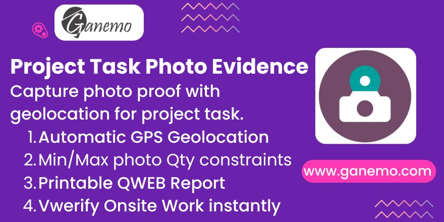

# **Project Task Photo Evidence**

## 🌟 Overview

The **Project Task Photo Evidence** module transforms Odoo into a robust field-verification tool. It enables task assignees to capture and document work progress through a secure, "app-like" mobile interface. Designed for high-reliability operations, it enforces business rules, captures GPS coordinates, and provides professional reporting for customers.

---

## 🚀 Key Features

### 📱 Premium Mobile Experience (PWA)
*   **App-like UI**: A dedicated **Portal App Launcher** providing a clean, "Thumb-Friendly" interface.
*   **PWA Installable**: Field workers can "Install" the app on their home screen for instant access.
*   **One-Hand UX**: Bottom navigation and horizontally scrollable filters for easy operation on mobile devices.

### 📍 Smart Evidence Collection
*   **Automatic Geolocation**: Stealthily captures GPS coordinates (Latitude/Longitude) during photo upload.
*   **Multi-Product Evidence**: Assign multiple products to a single task, each requiring different photo evidence.
*   **Rich Metadata**: Add descriptions and track timestamps for every photo captured.

### 🛡️ Business Rule Enforcement
*   **Min/Max Quantity Controls**: Scaling rules that multiply based on the Sales Order Line quantity.
*   **Visual Warnings**: Real-time alerts in the portal if evidence requirements are not met.
*   **Blocking Validation**: Prevents uploading more photos than the maximum allowed limit.

### 📊 Professional Visibility
*   **Public Share Link**: Secure, read-only dashboard for clients to see evidence live.
*   **Consolidated PDF**: Generate a professional internal PDF report summarizing all task evidence.
*   **Smart Search**: Filter tasks by name, project, product, or tags directly in the portal.

---

## ⚙️ Configuration

### 1. Define Product Requirements
To enforce photo collection for specific services:
1.  Go to **Sales > Products** and select a product.
2.  Enable **"Evidence Required"** in the Sales tab.
3.  Set **"Evidence Min Qty"** (Yellow warning if missing).
4.  Set **"Evidence Max Qty"** (Red error blocking excessive uploads).

### 2. Configure Project Automation
You can automate task progression when work is "Done" in the portal:
1.  Open a **Project** in configuration.
2.  Set **"Done Stage"** (Task will move here when the worker clicks "Done" in the portal).
3.  Set **"Done State"** (e.g., Set to 'Done' or 'Approved').

---

## 🔄 Workflow

### 👷 For Field Workers
1.  **Launch App**: Open the portal and click the **"Photos"** icon in the Launcher.
2.  **Filter & Search**: Use the bottom scrollable bar to find tasks by Project, Product, or Tag.
3.  **Upload**: Click a Task card. The dashboard shows what photos are missing.
4.  **Capture**: Upload images. Ensure browser **Location Access** is granted for GPS capture.
5.  **Complete**: Once all requirements are green, click **"Finalize Task"** to move it to the project's Done stage.

### 💼 For Managers
1.  **Monitor**: View real-time uploads from the Task's **Evidence** tab in the backend.
2.  **Report**: Click the **"Internal Report"** smart button to generate a PDF.
3.  **Share**: Use **"Generate Share Link"** to give your client a live view of the progress.

---

## 🛠️ Technical Notes

*   **Secure Context (HTTPS)**: Browsers **block** Geolocation and Camera access on insecure connections. Ensure your Odoo instance uses SSL.
*   **Portal App Launcher**: This module relies on the `portal_app_launcher` bridge for the enhanced UI.
*   **Sale Integration**: If a task is linked to a Sales Order, photo requirements scale automatically (e.g., 2 photos per piece ordered).

---

## 💳 Credits

**Author**: [Ganemo](https://www.ganemo.com)  
**Industry**: Specialized in Enterprise Odoo Localizations and Operational Excellence.  
**Support**: [leads@ganemo.com](mailto:leads@ganemo.com)
