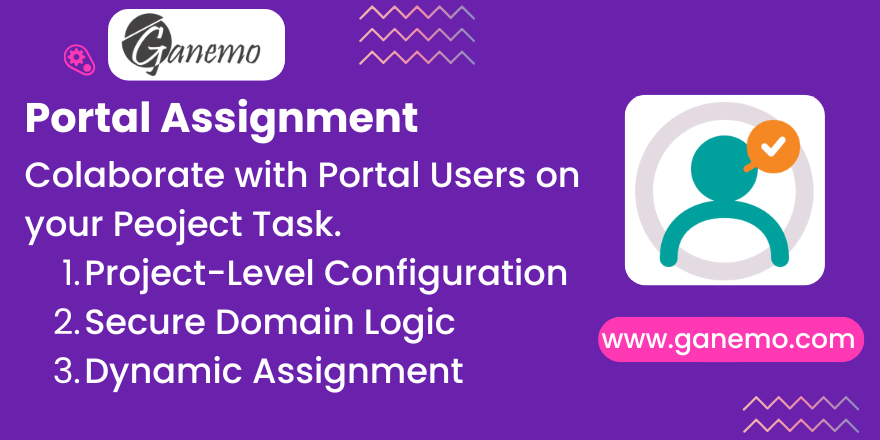

# Project Task Portal Assignment

Allow assigning Portal Users (External) to Project Tasks in Odoo 19.

This module provides a secure and configurable way to collaborate with contractors, clients, or freelance partners directly within your Projects. By default, Odoo restricts Task assignment to Internal Users. This module unlocks the ability to select Portal Users in the "Assignees" field, but only for specific projects where you explicitly allow it.

## Features

- **Project-Level Control**: Enable or disable Portal User assignment on a per-project basis.
- **Dynamic Filtering**: The "Assignees" dropdown automatically adjusts to show Portal Users only when the setting is enabled.
- **Security First**: Only users with "Share User" status (Portal) and who are Active are included. Internal Users remain assignable always.
- **Default Enabled**: New projects have this feature enabled by default for seamless adoption (configurable).

## Configuration

1. Go to **Project > Configuration > Settings**.
2. No global setting is required; the feature works out-of-the-box.
3. To configure a specific Project:
   - Go to your Project dashboard.
   - Open the **Settings** of the desired Project.
   - Under the "Assignment Settings" section (or similar configuration area), check or uncheck the **"Allow Portal User Assignment"** box.
   - **Tip:** This field defaults to `True` (Checked) for new projects.

## Usage

1. Open a **Task** within a project where the setting is enabled.
2. Click on the **Assignees** field.
3. Type the name of a **Portal User** (e.g., your contractor "Joel").
4. Select them from the list.
   - *Note:* If the user does not appear, verify that they are an active Contact and have "Portal" access rights.
5. Save the task. The Portal User will now see this task in their Portal view (depending on your generic Record Rules for Project Tasks).

## Technical Details

- **Supported Version**: Odoo 19.0 Enterprise / Community
- **Dependencies**: `project`
- **License**: OPL-1

## Common Questions / FAQ

**Q: Can I assign a Portal User to ANY project?**
A: No, only to projects where the "Allow Portal User Assignment" checkbox is ticked.

**Q: Does this give the Portal User access to the backend?**
A: No, they remain Portal Users. They will access the task via the standard Odoo Portal (Frontend) interface.

**Q: Why can't I see my Portal User in the list?**
A: Ensure that:
    1. The Project setting is enabled.
    2. The User is Active.
    3. The User is actually a Portal User (Share=True).

## Support

For technical assistance or bug reports, please contact our support team.

**Author**: [Ganemo](https://www.ganemo.co)
**Maintainer**: Ganemo
**Website**: https://www.ganemo.co
