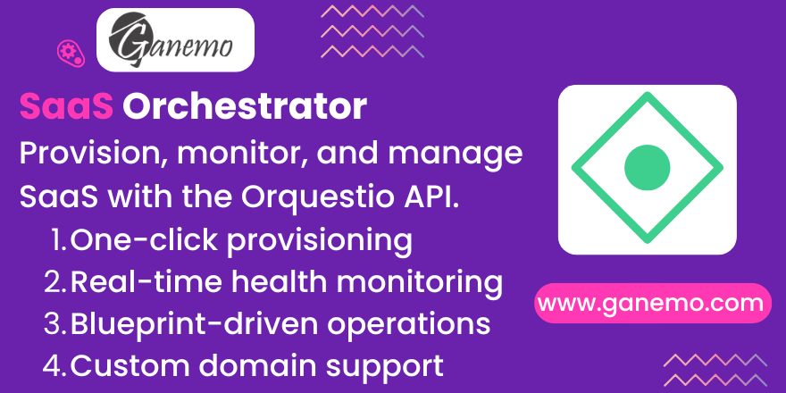

**SaaS Orchestrator**

Complete SaaS Instance Lifecycle Management for Odoo 19. Provision, monitor, and manage Odoo SaaS instances through seamless integration with the Orquestio orchestrator API.

---

## About This Module

The **SaaS Orchestrator** module provides a complete engine for managing SaaS tenant lifecycle operations directly within Odoo 19. It integrates with the Orquestio orchestrator API to automate the provisioning, monitoring, and lifecycle management of Odoo instances.

**Author**: [Ganemo](https://www.ganemo.com)

---

## Features

### 1. Automated Instance Provisioning
- Automatically creates and provisions SaaS instances when a subscription order is confirmed
- Tenants are created on-demand for each partner
- Instances spin up automatically without manual intervention

### 2. Real-Time Health Monitoring
- Track CPU, RAM, and disk usage for each instance
- Color-coded freshness indicators (Fresh/Stale/Missing) to identify instances that haven't reported in recently
- On-demand and bulk refresh capabilities

### 3. Blueprint-Driven Operations
- Define operations (upgrade, restart, rotate password, update environment variables) in the blueprint catalog
- Dispatch operations via intuitive wizards directly from the instance form
- Operations are declared per blueprint and automatically drive button visibility

### 4. Custom Domain Support (BYO)
- Customers can connect their own domain via Cloudflare for SaaS
- Manage DNS and TLS certificate status directly from Odoo
- Custom domain wizard for easy registration and changes

### 5. Subscription-Based Lifecycle
- Automatic suspension for non-payment after 7 days
- Automatic destruction after 30 days of non-payment
- Email notifications sent to customers before suspension/destruction
- Reactivation when payment is received

### 6. Task History Tracking
- Complete audit trail of all control plane operations
- Retention settings configurable per plan
- Maximum records limit configurable per plan

---

## Installation

### Prerequisites

This module requires the following dependencies:
- `base` (Odoo core)
- `mail` (Odoo core - for chatter and notifications)
- `product` (Odoo core)
- `sale_subscription` (Odoo Enterprise - Subscription management)
- `portal` (Odoo core - for customer portal access)

### Steps

1. Install the module from the Apps menu in Odoo
2. Go to **Settings > General Settings** and configure the SaaS Orchestrator section:
   - **Orchestrator URL**: The base URL of your Orquestio API (e.g., `https://api.orquestio.com`)
   - **API Key**: Your Bearer token for authentication
3. Click **Test Connection** to verify the configuration
4. Save the settings

---

## Configuration

### Creating a Product Blueprint

Blueprints define the infrastructure configuration for each product type you offer.

1. Go to **SaaS Orchestrator > Blueprints**
2. Create a new blueprint with the following:
   - **Name**: A descriptive name (e.g., "OpenClaw Standard")
   - **Domain**: The product domain in Cloudflare (e.g., `orquestio.com`)
   - **Docker Image**: The Docker image to deploy
   - **Terraform Module**: The Terraform module for infrastructure
   - **Container Port**: The port the application exposes
   - **Health Check Endpoint**: API endpoint for health checks (default: `/api/health`)

3. **Add Operations**: Declare the operations available for this blueprint:
   - **Code**: Unique identifier (e.g., `upgrade`, `restart`)
   - **Label**: User-friendly name
   - **Script Path**: Path on the EC2 host to the implementation script
   - **Timeout (seconds)**: Operation timeout
   - **Requires Drain**: Enable if the operation needs queue draining first

### Creating a Product Plan

Plans link a blueprint to pricing and resource tiers.

1. Go to **SaaS Orchestrator > Plans**
2. Create a new plan:
   - **Name**: Plan name (e.g., "Starter", "Professional")
   - **Blueprint**: Select the corresponding blueprint
   - **Instance Type**: EC2 instance type (e.g., `t4g.small`)
   - **Deployment Mode**: Dedicated or Shared
   - **Storage (GB)**: Included storage and extra storage pricing
   - **Environment Variables**: Included count and extra pricing
   - **History Settings**: Retention days and max records for operation history

3. Link the plan to a **Product Template** in Sales:
   - Go to the product form
   - In the **SaaS Plan** tab, select the corresponding plan

### Linking to Subscriptions

When a subscription order is confirmed:
1. The system automatically creates a **Tenant** for the customer
2. A **SaaS Instance** is created and linked to the subscription
3. The instance provisioning starts automatically via the Orquestio API

---

## Usage

### Managing Instances

1. Go to **SaaS Orchestrator > Instances**
2. Select an instance to view its details and available actions

### Available Actions

| Action | Description | Available When |
|--------|-------------|----------------|
| **Provision** | Start provisioning a new instance | Draft state |
| **Stop** | Stop a running instance | Running state |
| **Start** | Start a stopped instance | Stopped state |
| **Restart Host** | Stop and restart the EC2 host (~3 min downtime) | Running state |
| **Destroy** | Permanently destroy the instance | Not draft/destroyed |
| **Refresh** | Fetch current state from the orchestrator | Not draft/destroyed |
| **Upgrade** | Dispatch the upgrade operation | Running, blueprint supports it |
| **Restart App** | Restart the container (~5-10s) | Running, blueprint supports it |
| **Rotate Password** | Rotate gateway password | Running, blueprint supports it |
| **Set Env Var** | Set/update environment variable | Running, blueprint supports it |
| **Configure Custom Domain** | Connect a BYO domain | Running, no custom domain |
| **Change Custom Domain** | Modify custom domain | Running, has custom domain |
| **Refresh Custom Domain** | Check TLS/DNS status from Cloudflare | Has custom domain |
| **Remove Custom Domain** | Detach custom domain | Has custom domain |

### Bulk Operations

- Use the **Refresh** action on multiple instances (up to 50 at a time)
- View operation history in the **Operation History** tab on each instance

### Custom Domain Setup

1. Ensure your domain is registered and accessible in Cloudflare
2. In the instance form, click **Configure Custom Domain**
3. Enter your domain name (e.g., `ai.acme.com`)
4. The system creates the DNS record and initiates TLS certificate provisioning
5. Click **Refresh Custom Domain** to check the status

---

## Architecture

### Data Models

- **SaaS Tenant**: Represents a customer tenant/organization
- **SaaS Product Blueprint**: Infrastructure template for a product type
- **SaaS Product Plan**: Pricing and resource tier linked to a blueprint
- **SaaS Instance**: A running instance of a plan for a specific subscription
- **SaaS Instance Env Var**: Environment variables for an instance
- **SaaS Product Operation**: Operation catalog entry in a blueprint
- **SaaS Product Operation Param**: Parameters for an operation
- **SaaS Task History**: Audit log of all dispatched operations

### API Integration

The module communicates with the Orquestio orchestrator via REST API:
- **POST /instances/create**: Start provisioning
- **GET /instances/{id}/status**: Fetch instance state
- **POST /instances/{id}/stop**: Stop instance
- **POST /instances/{id}/start**: Start instance
- **POST /instances/{id}/restart**: Restart instance
- **DELETE /instances/{id}**: Destroy instance
- **POST /instances/{id}/tasks**: Dispatch operations
- **GET /instances/{id}/custom-domain**: Check custom domain status
- **POST /instances/{id}/custom-domain**: Set custom domain
- **DELETE /instances/{id}/custom-domain**: Remove custom domain

---

## Troubleshooting

### Connection to Orchestrator Failed
- Verify the URL is correct (no trailing slash)
- Check the API key is valid
- Ensure your network can reach the orchestrator URL
- Use the **Test Connection** button in Settings

### Instance Won't Provision
- Ensure the product template has a SaaS Plan assigned
- Verify the subscription order is confirmed
- Check the orchestrator API is responding
- Review the instance operation history for errors

### Operations Buttons Not Visible
- The blueprint for the instance's plan must declare those operations
- Go to the blueprint and add the corresponding operation entries
- Ensure the instance state is compatible with the operation

### Custom Domain Pending Forever
- DNS propagation can take up to 48 hours
- Click **Refresh Custom Domain** to check the latest status
- Verify the domain is properly configured in Cloudflare

---

## Support

For technical assistance or bug reports, contact our help desk:

📧 **Email**: [ayuda@ganemo.com](mailto:ayuda@ganemo.com)

For commercial inquiries, demos, or partnerships:

📱 **WhatsApp**: +1 (828) 672-6150
📧 **Email**: [leads@ganemo.com](mailto:leads@ganemo.com)
📅 **Schedule a Demo**: [ganemo.co/appointment/5](https://www.ganemo.co/appointment/5)

---

## License

**OPL-1** - Open License v1

This module is proprietary software developed by Ganemo. See the full license terms at [Odoo OPL-1](https://www.odoo.com/documentation/user/14.0/legal/licenses.html#odoo-apps).
