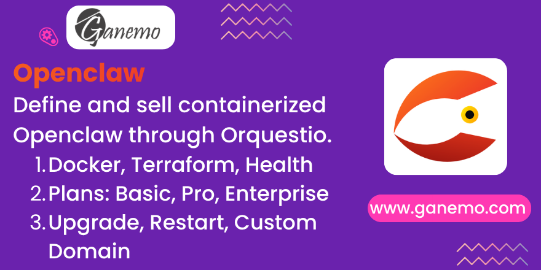

# SaaS Product: OpenClaw

This module defines the OpenClaw SaaS product blueprint for the Orquestio orchestrator. It declares the OpenClaw blueprint, tiered plans (Basic, Pro, Enterprise), and sellable product templates as master data on top of the generic saas_orchestrator layer.

## Key Features

- **Blueprint Definition**: Define Docker image, port mappings, Terraform module, health check endpoints, and access URL templates for the OpenClaw service
- **Tiered Plans**: Three plans with different instance types, storage, environment variables, and retention policies
- **Product Templates**: Automatically created sellable products for each plan (Basic, Pro, Enterprise)
- **Operations**: End-user operations including upgrade, restart, rotate password, and custom domain management
- **Custom Domain Support**: Integration with Let's Encrypt for automatic certificate management

## Installation

1. Ensure `saas_orchestrator` is installed
2. Install this module from Apps
3. The blueprint, plans, and product templates are automatically loaded

## Configuration

No additional configuration required. The module loads all master data automatically upon installation.

## Usage

- Navigate to Sales > Products to view the created OpenClaw products
- Each product is linked to a specific plan with defined resources
- Customers can request operations through the customer portal if enabled

## Plans Comparison

| Plan       | Instance   | Storage | Env Vars | Backup  | History |
|------------|------------|---------|----------|---------|---------|
| Basic      | t4g.small  | 10 GB   | 5        | 7 days  | 30 days |
| Pro        | t4g.medium | 10 GB   | 20       | 7 days  | 90 days |
| Enterprise| t4g.large  | 25 GB   | 50       | 30 days | 365 days|

---

**Author**: [Ganemo](https://www.ganemo.co)