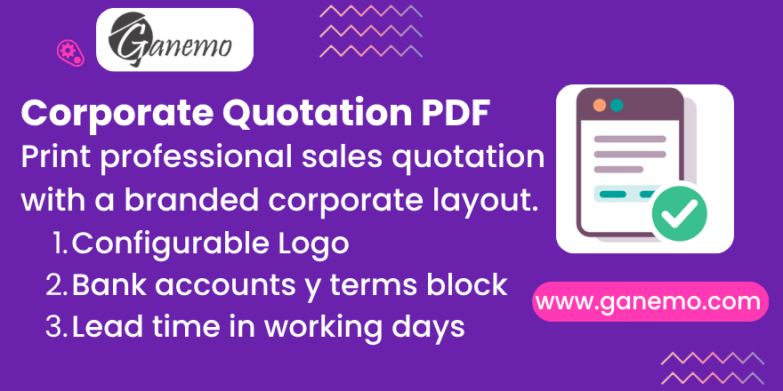

# **Corporate Sales Quotation PDF**

Replace the standard Odoo sales quotation with a professional, corporate-branded
PDF that you configure **once per company**. Every sale order can be printed as a
clean, four-part offer with your logos, certification seal, an optional document
code, a bank-account payment block, a working-day delivery promise and your terms.

This document is self-contained: after reading it you should be able to configure
and use the module without any additional manual.

---

## Key Features

- **Branded header** on every page: company logo + optional certification seal
  (ISO 9001 / SGS / UKAS), optional internal document code, company RUC / address
  / phone and page numbering.
- **Four-part body**:
  1. **Description / Costs** — items, line sections, notes, subtotal, tax (IGV 18%)
     and total.
  2. **Payment Details** — payment term, offer validity, account holder (your
     company name, taken dynamically) and a free **HTML block** for bank accounts,
     withholdings and conditions.
  3. **Delivery Time & Place** — shipping address and the delivery lead time in
     **working days**.
  4. **Terms & Conditions** — the sale order notes.
- **Branded footer** on every page: address, phone (with optional icon) and
  email / website (with optional icon).
- **Per-company** configuration — multi-company safe.
- **English** interface with **Spanish** translation included.

---

## Requirements & Dependencies

| Dependency | Why |
|---|---|
| `sale_management` | Base sales / quotation management. |
| `web` | QWeb PDF reporting engine. |
| `sale_delivery_lead_workdays` | Provides the **Delivery Lead Time (Working Days)** field printed in Part 3 (it converts working days to calendar days using the warehouse working calendar). Pulls in `sale_stock`. |

> The delivery lead time shown on the report is the working-day value entered on
> the order; the dependency keeps Odoo's native scheduled date consistent.

---

## Configuration

Go to **Settings → Companies**, open your company and select the
**Corporate Quotation** tab. All fields are optional and the report degrades
gracefully when they are empty.

| Field | Effect on the report |
|---|---|
| **Document Code** | Printed in the top-right corner of the header (e.g. `XX-YY-FT-000 Rev. 0`). Empty → no code printed. |
| **Certification Logo** | Image printed next to the company logo in the header. Empty → only the company logo. |
| **Phone Icon (Footer)** | SVG icon printed before the phone number in the footer. Empty → number without icon. |
| **Email Icon (Footer)** | SVG icon printed before the email in the footer. Empty → email without icon. |
| **Payment Details** | HTML block printed in Part 2 (bank accounts, withholdings, conditions). Empty → a placeholder note invites you to configure it. |

The **bank-account holder** printed in Part 2 is always your company's name, so
there is nothing company-specific hard-coded in the template.

---

## Usage

1. Create or open a **sale order** and build it as usual (customer, products,
   sections, notes).
2. Set the **Payment Term** and the **Validity** date if you want them in Part 2.
3. Set the **Delivery Lead Time (Working Days)** (field added by the dependency)
   to populate Part 3.
4. Click **Print → Quotation** to generate the corporate PDF.

The PDF filename follows `Cotización - <order reference>`.

---

## Notes

- The printed quotation content is in **Spanish** (target market), while the
  configuration interface is in English with a Spanish translation. The report
  language can be internationalized on request.
- The report is registered as a print action on `sale.order`; the native Odoo
  quotation report is left untouched.

---

## Support

- **Sales:** [leads@ganemo.com](mailto:leads@ganemo.com)
- **Technical support:** [ayuda@ganemo.com](mailto:ayuda@ganemo.com)
- **Book a demo:** [ganemo.co/appointment/5](https://www.ganemo.co/appointment/5)

---

**Author**: [Ganemo](https://www.ganemo.com)
