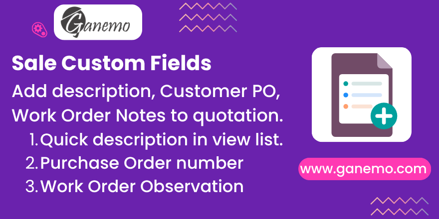

# **Sale Custom Fields**

Add the custom fields your whole organization needs directly on the Odoo
quotation and sale order: a short **Description** to identify orders at a
glance, the **Customer Purchase Order** number, and **Work Order
Observations** for your operations team.

**Author**: [Ganemo](https://www.ganemo.com)

---

## Overview

`sale_custom_fields` is a lightweight extension of the standard **Sales** app.
It adds three informational fields to `sale.order` so that data captured by
salespeople becomes available to the rest of the company (Operations,
Accounting, Support) without leaving the order.

The module adds **no business logic**: the fields are pure storage. They never
affect pricing, taxes, the confirmation flow or invoicing.

---

## Features

| Field | Type | Purpose |
|-------|------|---------|
| **Description** | Text | A short summary that identifies a quotation at a glance. Shown as an optional column in the Quotations and Sales Orders list views. |
| **Customer Purchase Order** | Char | The customer's purchase-order number, recorded once they confirm the sale. |
| **Work Order Observations** | Text | Free-text notes intended to be printed in the *Observations* section of a Work Order report (Orden de Trabajo). |

- Fields appear in the **Order Info** group of the quotation / sale order form.
- The **Description** column is available (optional, shown by default) in both
  the *Quotations* and *Sales Orders* list views.
- Fully translated into **English** and **Spanish**.

---

## Requirements

- Odoo **19.0**
- The standard **Sales** (`sale`) application.

There are no other dependencies.

---

## Installation

1. Copy the `sale_custom_fields` folder into your Odoo `addons` path.
2. Go to **Apps** and click **Update Apps List** (developer mode).
3. Remove the default *Apps* filter and search for **Sale Custom Fields**.
4. Click **Install**.

No configuration is required — the fields appear automatically on every
quotation once the module is installed.

---

## Usage

### 1. Description

1. Open any record under **Sales → Orders → Quotations**.
2. In the **Order Info** area, fill the **Description** field with a short
   title, e.g. *"Office furniture – Q3 restock"*.
3. Save.

To see it in the list: open the **Quotations** or **Sales Orders** list view,
click the optional-columns toggle at the top-right of the list, and enable
**Description**.

### 2. Customer Purchase Order

On the sale order, type the customer's PO number in **Customer Purchase Order**
once they confirm. The reference stays attached to the order for invoicing and
follow-up.

### 3. Work Order Observations

Write any shop-floor or operational notes in **Work Order Observations**. The
field is designed to be referenced from a Work Order (Orden de Trabajo) report
template so the notes print in its *Observations* section.

---

## Frequently Asked Questions

**Do these fields change pricing or taxes?**
No. They are purely informational and never affect totals or the sales flow.

**Why can't I see the Description column?**
It is an optional column. Enable it from the column-options icon at the
top-right of the list view.

**Are the Work Order Observations printed automatically?**
This module stores the note. Printing happens in your Work Order report, which
can reference the `work_order_observations` field.

**Is it available in Spanish?**
Yes. The module ships with a complete Spanish translation for every label and
help text.

---

## Technical Notes

- Model extended: `sale.order` (`_inherit`).
- New fields: `sale_description` (Text), `customer_purchase_order` (Char),
  `work_order_observations` (Text).
- Views inherited: `sale.view_order_form`,
  `sale.view_quotation_tree_with_onboarding`, `sale.view_order_tree`.
- Translations: `i18n/es.po`.

---

## License

This module is published under the **Odoo Proprietary License v1.0 (OPL-1)**.
See [LICENSE.txt](LICENSE.txt).

---

**Author**: [Ganemo](https://www.ganemo.com) · [www.ganemo.co](https://www.ganemo.co)
