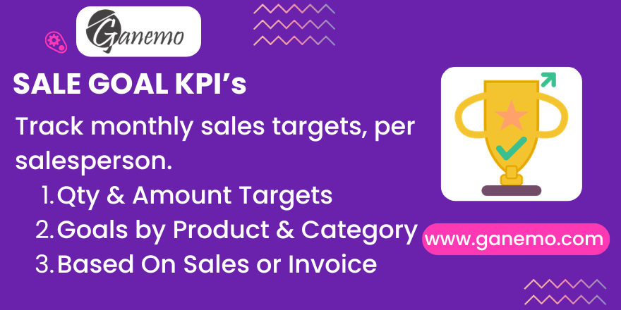

# **Sale Goal — Monthly Sales Targets by Salesperson**



## Overview

**Sale Goal** is an Odoo 19 module that allows **Sales Managers** to define and track
monthly sales targets for each salesperson, broken down by specific **products** or
**product categories**. Progress is tracked in both **quantity** and **monetary amount**,
and is automatically updated whenever sales orders are confirmed or invoices are validated.

---

## Key Features

| Feature | Description |
|---|---|
| **Monthly Goals** | One goal record per salesperson per month/year (unique constraint) |
| **Granular Lines** | Multiple lines per goal, each targeting a product or product category |
| **Dual Metrics** | Track both quantity targets and amount (revenue) targets simultaneously |
| **Flexible Source** | Choose between Confirmed Sale Orders or Validated Customer Invoices per goal |
| **Auto-Recompute** | Triggers fire automatically on SO confirm/cancel and Invoice post/cancel |
| **Manual Update** | "Update Results" button on form view; bulk action in list view |
| **Copy Previous Month** | One click to duplicate last month's goal lines into the current period |
| **Credit Notes Deducted** | `out_refund` moves subtract from achieved qty/amount automatically |
| **Progress Bars** | Visual percentage bars per goal line in the form view |
| **Role-Based Security** | Managers: full CRUD on all goals. Salespeople: read-only their own goals |
| **Analysis Views** | Built-in Pivot and Graph views for cross-salesperson/period analysis |
| **i18n** | Full English + Spanish (es) translations included |

---

## Architecture

### Models

```
sale.goal (Header)
│  user_id       → Salesperson (res.users)
│  month         → Integer 1–12
│  year          → Integer (e.g. 2026)
│  date_start    → Computed: first day of period
│  date_end      → Computed: last day of period
│  source_type   → 'sale_order' | 'invoice'
│  state         → 'draft' | 'active' | 'achieved'
│  company_id    → Multi-company support
│
└─ sale.goal.line (Lines)
      goal_type    → 'product' | 'categ'
      product_id   → product.product (if goal_type='product')
      categ_id     → product.category (if goal_type='categ')
      qty_goal     → Target quantity
      amount_goal  → Target amount
      qty_done     → Achieved quantity (stored, auto-computed)
      amount_done  → Achieved amount (stored, auto-computed)
      pct_qty      → % of qty_goal achieved
      pct_amount   → % of amount_goal achieved
```

### Automatic Triggers

| Event | Trigger | Affects |
|---|---|---|
| SO `action_confirm` | Override on `sale.order` | Goals with `source_type='sale_order'` |
| SO `action_cancel` | Override on `sale.order` | Goals with `source_type='sale_order'` |
| Invoice `_post` | Override on `account.move` | Goals with `source_type='invoice'` |
| Invoice `button_cancel` | Override on `account.move` | Goals with `source_type='invoice'` |

### Data Source Logic

- **Sale Orders**: Reads from `sale.order.line` of confirmed orders (`state in ('sale', 'done')`)
  filtered by salesperson (`user_id`) and date within the goal's month/year.
- **Invoices**: Reads from `account.move.line` of posted invoices and credit notes
  (`move_id.move_type in ('out_invoice', 'out_refund')`) filtered by `invoice_user_id`
  and `invoice_date` within the period. Credit Notes apply a negative sign.

---

## Installation

1. Copy the `sale_goal` folder to your Odoo `addons/` directory (or custom addons path).
2. Restart Odoo service.
3. Go to **Settings → Apps** and search for `Sale Goal`.
4. Click **Install**.

> **Dependencies**: `sale_management`, `account`

---

## Configuration

1. Ensure users who will be Salespeople have the **Sales / User** group.
2. Sales Managers require **Sales / Administrator** group to create and manage goals.
3. No additional configuration is required — the module is self-contained.

---

## Usage Guide

### Creating a Sales Goal (Manager)

1. Go to **Sales → Sales Goals → New**.
2. Fill in:
   - **Salesperson**: The user whose targets you are defining.
   - **Month** / **Year**: The period for this goal.
   - **Data Source**: `Sale Orders` (tracks confirmed SOs) or `Invoices` (tracks posted invoices).
3. In the **Goal Lines** tab, add lines:
   - Set **Goal Type** to `Product` or `Category`.
   - Select the corresponding **Product** or **Product Category**.
   - Set **Qty Target** and **Amount Target**.
4. Save the record.

### Copying from Previous Month

Click **Copy Previous Month** on the form view. All goal lines from the previous
month (same salesperson) are cloned into the current goal, ready to adjust.

### Updating Progress

- **Automatic**: Progress updates automatically when SOs are confirmed/cancelled or
  invoices are posted/cancelled.
- **Manual**: Click **Update Results** on the form, or select multiple goals in the
  list view and use **Action → Update Results**.

### Viewing Goals (Salesperson)

Salespeople access **Sales → Sales Goals** and see only their own goals (Record Rules applied).
They can view progress bars, achieved quantities, and percentages but cannot edit records.

### Analysis

Go to **Sales → Sales Goals → Goals Analysis** for Pivot and Graph views, allowing
comparison across salespeople, months, products, and categories.

---

## Frequently Asked Questions

**Q: Can a salesperson have multiple goal records for the same month?**
A: No. A UNIQUE database constraint (user_id + month + year + company_id) prevents duplicate
records. Add multiple goal lines within the same record instead.

**Q: Does Source Type affect which triggers fire?**
A: Yes. Confirming a Sale Order only recomputes goals with `source_type = 'sale_order'`.
Posting an invoice only recomputes goals with `source_type = 'invoice'`.

**Q: Are subcategories included in category goals?**
A: Yes. The ORM domain uses `child_of`, so products in any subcategory of the selected
category are automatically included.

**Q: How are Credit Notes handled?**
A: Customer credit notes (`out_refund`) apply a negative sign to both `qty_done` and
`amount_done`, preventing returned goods from inflating achievement figures.

**Q: Is multi-company supported?**
A: Yes. The `company_id` field is included in the UNIQUE constraint, so each company
has independent goal records.

---

## Security

| Group | Permissions |
|---|---|
| `Sales / Administrator` | Full CRUD on all goals and goal lines (all companies) |
| `Sales / User` | Read-only access to their own goals and goal lines only |

Record Rules enforce the salesperson restriction at the database level — not just the
UI — preventing data leaks via RPC or API calls.

---

## Changelog

| Version | Date | Changes |
|---|---|---|
| 19.0.1.0.0 | 2026-03-06 | Initial release |

---

**Author**: [Ganemo](https://www.ganemo.com)
