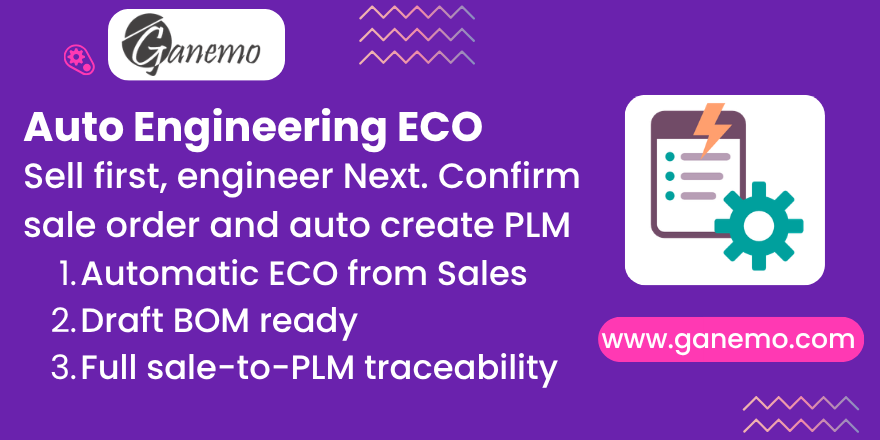

**Auto Engineering ECO**

Automatically create a PLM Engineering Change Order (ECO) and a draft Bill of
Materials the moment a sale of a made-to-order product is confirmed — bridging
your Sales and Engineering teams without any manual hand-off.

**Author**: [Ganemo](https://www.ganemo.com)

---

## What it does

When a sale order is confirmed, the module inspects every order line. For each
**eligible** product it creates, in one step:

1. A draft **Bill of Materials** (`mrp.bom`) for the product, ready for
   engineering to fill in with components.
2. A **PLM Engineering Change Order** (`mrp.eco`, type *Bill of Materials*)
   linked to that BOM and to the originating sale order.

The ECO lands in the first stage of the ECO Type you configured, so it appears
immediately in the engineering pipeline.

## Eligibility rules

A product generates an ECO only when **all three** conditions are met:

| # | Condition | Where it is set |
|---|-----------|-----------------|
| 1 | Its product category is flagged **Requires custom engineering** | Product Category form |
| 2 | It is a **storable good** (`type = consu` and *Track Inventory* enabled) | Product form |
| 3 | It has **no active Bill of Materials** yet | Manufacturing > BoM |

Standard products, services, and products that already have a BOM are skipped
automatically. Multiple lines of the same product produce a single ECO/BOM.

## Configuration

1. Go to **Inventory ▸ Configuration ▸ Product Categories** (or open a category
   from any product).
2. Enable **Requires custom engineering**.
3. Select the **ECO Type** that engineering should use for products in this
   category. *(This field is required once the flag is enabled — without an ECO
   Type no ECO can be created.)*
4. Make sure your made-to-order products belong to that category and are
   storable goods without an existing BOM.

> **Tip:** The ECO Type drives which engineering stages the ECO moves through.
> The module assigns the first stage by sequence, mirroring how Odoo PLM behaves
> when you create an ECO manually.

## Daily workflow

1. A salesperson confirms a quotation containing a made-to-order product.
2. Odoo silently creates the ECO and its draft BOM.
3. The sale order shows an **ECOs** smart button (top-right) with the number of
   engineering orders it generated — click it to open them.
4. Each ECO displays the **source sale order number** for traceability.
5. Engineering adds the components to the BOM from inside the ECO, following the
   standard Odoo PLM revision flow.

## Key guarantees

- **No PLM permissions required to trigger it.** The ECO and BOM are created
  with elevated privileges, so any user who can confirm a sale order activates
  the automation. *(Note: viewing the generated ECOs from the smart button still
  requires PLM read access — see Limitations.)*
- **Idempotent.** Re-confirming a sale order (cancel ▸ draft ▸ confirm) never
  creates duplicate ECOs or BOMs.
- **Never blocks a sale.** If ECO creation fails for any reason (e.g. the
  category has no ECO Type configured), the sale order still confirms and the
  problem is written to the server log.

## What gets added to Odoo

| Model | Field / element | Purpose |
|-------|-----------------|---------|
| `product.category` | **Requires custom engineering** (boolean) | Marks categories whose products need an ECO |
| `product.category` | **ECO Type** (`mrp.eco.type`) | ECO type used for the generated ECOs |
| `mrp.eco` | **Source sale order** | Sale order that originated the ECO |
| `sale.order` | **ECOs** smart button | Opens the ECOs generated by the order |

## Limitations

- The **ECOs smart button** opens `mrp.eco` records with the current user's own
  permissions. A user without PLM read access can confirm the sale and trigger
  the ECO, but will get an access error if they click through to view it. Grant
  PLM read access to users who need to open the ECOs.

## Requirements

- Odoo **19.0** (Enterprise / Odoo.SH / Ganemo Online).
- Depends on: `sale_management`, `mrp`, `mrp_plm`.

## Languages

Fully translated into **English** and **Spanish** (es).

---

**Author & Support**: [Ganemo](https://www.ganemo.com) — commercial inquiries:
leads@ganemo.com · technical support: ayuda@ganemo.com
