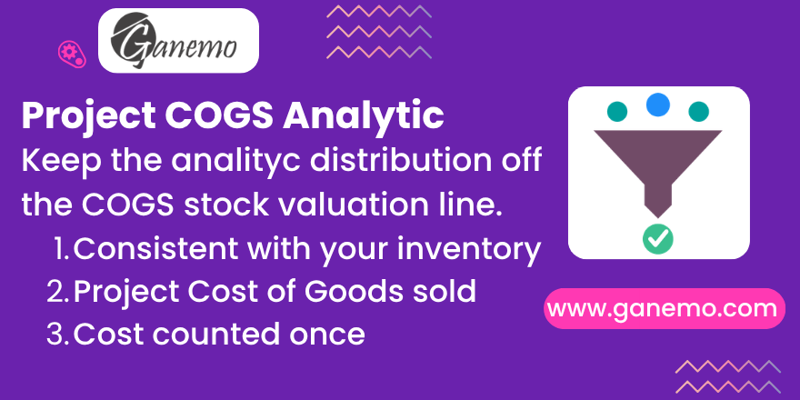

# **Sale Project Analytic Filter**

Keep the analytic distribution **off the stock valuation line** of the Cost of
Goods Sold entry, so your project COGS no longer cancels out in the analytic
ledger. Odoo 19.

**Author**: [Ganemo](https://www.ganemo.com)

---

## What it does

When a project is created from a sales order, `sale_project` stamps the
project's analytic distribution on every invoice line that is not a
receivable/payable account. That filter is too coarse: it also tags the COGS
line booked on the product's **stock valuation** account, which is the inventory
counterpart of the Cost of Goods Sold pair. As a result the two COGS lines carry
the same distribution with opposite balances and **cancel each other out** in the
project's analytic ledger — so the cost of goods sold disappears from project
profitability.

This bridge module reimposes the right invariant: the **stock valuation line
(the inventory counterpart) never carries analytic**, while its counterpart — the
COGS **expense** line — does.

- After the standard computation runs, any COGS line booked on the product's
  stock valuation account has its analytic distribution **cleared**.
- The COGS **expense** line keeps the distribution, so the project sees the cost
  **once**.
- This is the **same account criterion** the inventory valuation entry uses
  (`stock_analytic_distribution`), so behaviour is consistent across the suite.

### Native and safe

The correction is **self-neutralizing**: it only removes a distribution that
should not be there. If a future Odoo release stops mis-tagging the stock
valuation line, there is simply nothing to clear and the module becomes a
harmless no-op — it never errors.

---

## Requirements

- Depends on `sale_project` and `stock_account` (standard Odoo modules).
- The behaviour is relevant for products valued in **real time** (perpetual),
  where the Cost of Goods Sold entry is generated on the customer invoice.

## Configuration

Nothing to configure — the correction is **enabled by default** for every
company. Optionally, in **Accounting → Configuration → Settings**, the setting
**"Keep analytic off the COGS stock valuation line"** lets you revert to the
standard behaviour per company, without uninstalling.

## Usage

1. Sell a storable, real-time-valued product through a sale order that creates a
   **project**.
2. Deliver and invoice it, and post the customer invoice.
3. Open the invoice's journal items: the **COGS expense** line carries the
   project's analytic distribution, while the **stock valuation** line does not.
4. Open the project's **Analytic Items** or profitability report: the cost of
   goods sold appears **once**, no longer cancelled out.

---

## Frequently asked questions

**Why was the cost of goods sold cancelling out in my project?**
Because `sale_project` tagged both COGS lines (expense and stock valuation) with
the same analytic distribution and opposite balances, so they offset to zero.
This module clears the valuation line and leaves the cost on the expense line.

**Does it touch any other line?**
No. Only the COGS line booked on the product's stock valuation account is
cleared — the same account the inventory valuation entry excludes.

**Can I disable it?**
Yes, per company, with a single setting in Accounting. No uninstall needed.

**Is it multi-company?**
Yes. The stock valuation account is resolved per company, and the setting is
stored per company.

---

## License

Odoo Proprietary License v1.0 (OPL-1). See the `LICENSE.txt` file.

© 2026 [Ganemo](https://www.ganemo.com). All rights reserved.
