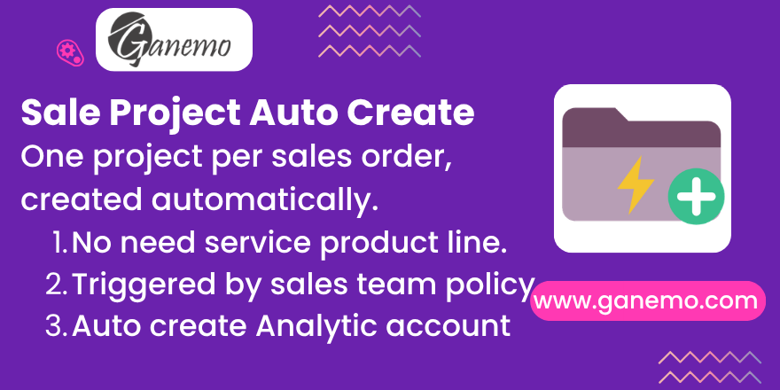

# **Sale Project Auto Create**

Create a project (with its analytic account) on **sales order confirmation by
policy**, without forcing a service product line on the quotation. Odoo 19.

**Author**: [Ganemo](https://www.ganemo.com)

---

## What it does

Natively, Odoo only creates a project from a sales order when the order contains
a **service** product whose *"Create on Order"* (`service_tracking`) is set to
generate one. That forces a product line on the quotation — even a zero-priced
one still shows up — when all you want is to govern **one project per sales
order**.

This module decouples project creation from the catalogue. On confirmation, if
the order is flagged for it, a project is created and linked to the order
(`project_id`) together with its **analytic account** — exactly the same plumbing
the native flow produces, but triggered by policy instead of by a product line.

- A **sales team** boolean (*"Create Project on Sales Confirmation"*) sets the
  default policy.
- A **per-order** boolean, in the *Other Info* tab, inherits that default and can
  be overridden on each order.
- The project's **analytic account** is assigned to the order, so invoices and
  costs flow to the project the native way.

### Native and safe

- It runs **before** native confirmation, so the **stock procurement carries the
  project** just like the native service-product flow.
- It **never collides** with the native generation: when a service product is
  already configured to generate a project/task, the module steps aside. It also
  does nothing when the order already has a project, so **re-confirmation is
  idempotent** and there is never a duplicate.
- It reuses the native helpers and the native project wiring, so it follows
  upstream behaviour rather than reimplementing it.

---

## Requirements

- Depends on `sale_project` (standard Odoo module).

## Configuration

1. Go to **CRM / Sales → Configuration → Sales Teams**, open a team and tick
   **"Create Project on Sales Confirmation"**.
2. New orders of that team inherit the policy. The same toggle is available on
   each order, in the **Other Info** tab, to override it per order.

## Usage

1. On a flagged team, create a sales order — even with **only regular
   products** — and confirm it.
2. A **project** is created and linked to the order, with its **analytic
   account** assigned to the order.
3. If the order already contains a service product that generates a project
   natively, that native project is used and **no duplicate** is created.

---

## Frequently asked questions

**Do I still need a service product to get a project?**
No. The project is created from the team/order policy, so your quotation stays
free of dummy service lines.

**Will it clash with the native flow?**
No. When a service product already generates a project, the module does nothing —
one project per order is always respected.

**Can I decide order by order?**
Yes. The team sets the default; the toggle in the order's *Other Info* tab
overrides it.

**Does the project get an analytic account?**
Yes. The project is created with its analytic account and the account is assigned
to the order, so invoices and costs flow to the project.

---

## License

Odoo Proprietary License v1.0 (OPL-1). See the `LICENSE.txt` file.

© 2026 [Ganemo](https://www.ganemo.com). All rights reserved.
