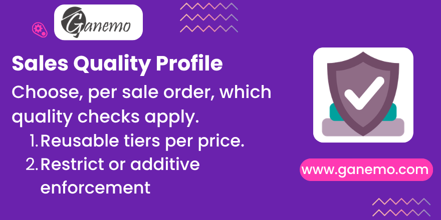

**Sale Quality Profiles**

Choose, **per sale order**, which Quality Control Points apply to its
Manufacturing Orders and Delivery operations — without ever breaking native
Odoo quality behavior.

**Author**: [Ganemo](https://www.ganemo.com)
**License**: OPL-1 · **Odoo version**: 19.0

---

## Why this module?

The required quality often depends on the **customer** and the **price**: the
same product may need a lean checklist for one order and a full premium
inspection for another. Native Odoo applies Quality Control Points globally by
operation type and product, with no way to vary them order by order.

**Sale Quality Profiles** introduces reusable *Quality Profiles* (tiers such as
*Basic*, *Standard*, *Premium*) that group Quality Control Points. Each sale
order can pick **one profile for Manufacturing** and **one for Delivery**,
independently.

## Design principles

- **Non-invasive.** Quality checks are still created by native Odoo. This module
  only **prunes or augments** the result *after* the native creation, so it stays
  resilient to Odoo internal changes and upgrades.
- **Opt-in.** Only operations belonging to a sale order **with a profile** are
  affected. Every other flow keeps the exact native behavior.
- **Focused scope.** It manages control points measured **per Operation** and
  **per Product**. Per-quantity (move-line) checks keep their native behavior.

---

## Key concepts

### Quality Profile (`quality.profile`)

A reusable, 100%-custom model (it touches no native quality model). Fields:

| Field | Meaning |
|---|---|
| **Name** | Label of the tier (e.g. *Premium*). |
| **Control Points** | The `quality.point` records that make up the profile. |
| **Behavior** | *Restrict* (whitelist) or *Additive* (native + these). |
| **Company** | Optional company for multi-company setups. |
| **# Points** | Computed count of control points. |

### Behavior modes

- **Restrict (whitelist).** On the order's operations, only the profile's points
  generate checks; every other natively-matching check is pruned. An **empty
  point list therefore means "no checks at all"** for that operation.
- **Additive.** The native matching points are kept **and** the profile's points
  are *forced* onto the operation — even if they would not match natively by
  product — respecting each point's operation type.

> Only pending checks (`quality_state = 'none'`) are ever pruned. Checks that are
> already passed/failed are never touched.

---

## Configuration

1. Go to **Quality ▸ Configuration ▸ Quality Profiles**.
2. Create a profile, choose its **Behavior**, and add its **Control Points**.
3. Open a **Sale Order** and set:
   - **Manufacturing Quality Profile** — applied to the Manufacturing Orders
     spawned by the order.
   - **Delivery Quality Profile** — applied to the order's delivery operations.
4. Confirm the order. Checks are generated natively and then adjusted to the
   selected profile(s).

Leave a profile field **empty** to keep Odoo's native behavior for that
operation type.

## Usage

- **Independent flows.** A *Delivery* profile only affects delivery checks and a
  *Manufacturing* profile only affects manufacturing checks — the separation is
  driven by each control point's operation type.
- **Regenerate after a change.** If you change the profile *after* confirming the
  order, press **Regenerate Quality Checks** on the sale order. It rebuilds the
  pending checks of all open operations from the current profile; completed
  checks are left untouched. The button is visible to Quality users when the
  order is confirmed and at least one profile is set.

## Learning demo

Install the module **with demo data** to load a fully-worked set of scenarios —
*Standard*, *Premium*, *Native (no profile)*, *No-Controls*, and *Additive* —
each with a didactic explanation written into the chatter of every related
record (profiles, points, orders, and generated checks), including cross-links so
you can follow exactly why each quality check was (or was not) created.

---

## Technical notes

- Extends `stock.move._create_quality_checks` (delivery / `quality_control`) and
  `stock.move._create_quality_checks_for_mo` (manufacturing / `quality_mrp`),
  always calling `super()` first.
- The MO ▸ sale link is resolved conservatively via
  `reference_ids.sale_ids`; if a Manufacturing Order maps to more than one sale
  order, the profile filter is skipped to preserve native behavior (logged for
  traceability).
- Additive product-level checks on a Manufacturing Order only target the
  finished product(s), honoring Odoo's `quality_mrp` constraint.

## Requirements

Depends on: `sale_stock`, `sale_mrp`, `quality_control`, `quality_mrp`
(Odoo 19 Enterprise / Odoo.SH / Ganemo Online).

## Languages

Fully available in **English** and **Spanish**.

---

**Author**: [Ganemo](https://www.ganemo.com) — the world's leading Odoo App
developer and multi-award-winning Gold Partner.
