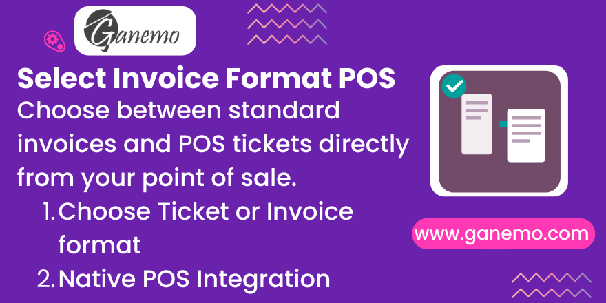

# **Select Invoice Format POS**

## Overview

**Select Invoice Format POS** is an essential module for Odoo 19 that provides flexibility in printing sales documents. It allows Point of Sale operators to choose between standard POS tickets and full-sized standard invoices (A4/Letter) directly from the receipt screen. This module integrates seamlessly with the POS workflow, enabling businesses to meet diverse customer needs and tax requirements with a single configuration.

---

## Key Features

*   ✅ **Dynamic Format Selection**: Choose the preferred invoice report (Standard Invoice, Simplified Invoice, etc.) in the POS settings.
*   ✅ **Native POS Buttons**: Adds a dedicated "Electronic Receipt" button to the POS receipt screen.
*   ✅ **Real-time Generation**: Generates and prints the selected report format instantly after payment.
*   ✅ **Multi-format Support**: Compatible with any Odoo report configured for the `account.move` model.
*   ✅ **Multi-company & Multi-language**: Full support for international operations and English/Spanish languages.
*   ✅ **Native Integration**: Works perfectly with `pos_ticket_base_template` for a consistent experience.

---

## Configuration

### 1. Module Setup
Ensure the module is installed. Go to **Apps**, search for `Select Invoice Format POS` and click **Install**.

### 2. Configure POS Invoice Format
1.  Go to **Point of Sale** > **Configuration** > **Settings**.
2.  Select the POS session you wish to configure.
3.  Scroll down to the **Invoicing** section.
4.  Locate the **Invoice Format** field.
5.  Select your desired report (e.g., "Invoices").
6.  Click **Save**.

### 3. Report Accessibility
Ensure the selected report is active and compatible with `account.move`. Any custom report created via Odoo Studio or code will appear here.

---

## Usage Guide

### Step 1: Process a Sale
Open your POS session and add items to the cart. Proceed to the **Payment** screen.

### Step 2: Customer Selection (Optional)
If you require an invoice, select the customer as usual.

### Step 3: Complete Payment
Validate the payment using any available method.

### Step 4: Print chosen Format
On the **Receipt Screen**, you will see the standard print buttons plus a new one: **"Electronic Receipt"**.
*   Click **"Electronic Receipt"** to print the document in the format you configured in Step 2.
*   The system will process the report and open the print dialog/send to printer immediately.
*   You can print it multiple times if needed.

---

## FAQ & Troubleshooting

### Q: Can I use my own custom-designed invoices?
**A**: Yes. Any report associated with the `account.move` model will be selectable in the configuration.

### Q: What if I don't select an invoice format in settings?
**A**: The module will default to Odoo's standard "Invoices" report for the electronic receipt button.

### Q: The button is not appearing on the receipt screen.
**A**: Make sure you have saved the configuration in POS settings and have refreshed/reopened the POS session.

### Q: Is it compatible with Odoo Community?
**A**: This module is designed for **Odoo Enterprise** (Odoo.SH, Ganemo Online, or self-hosted Enterprise) as it relies on professional invoicing features.

---

## Compatibility

*   **Odoo Version**: 19.0
*   **Edition**: Enterprise, Odoo.SH, Ganemo Online.
*   **Dependencies**: `pos_ticket_base_template`.
*   **Languages**: English, Spanish (es_ES, es_PE, es_MX).

---

## Support & Commercial Information

### Commercial Inquiries
For quotes, custom development, or demos:
*   **WhatsApp**: [+1 (828) 672-6150](https://wa.me/18286726150)
*   **Email**: [leads@ganemo.com](mailto:leads@ganemo.com)
*   **Link**: [Book a demo](https://www.ganemo.co/appointment/5)

### Technical Support
*   **Help Desk**: [ayuda@ganemo.com](mailto:ayuda@ganemo.com)

---

## Credits

**Author**: [Ganemo](https://www.ganemo.com)

**Maintainer**: Ganemo

**Company**: Ganemo

**Website**: [https://www.ganemo.co](https://www.ganemo.co)

---

## License

This module is licensed under the **Odoo Proprietary License v1.0 (OPL-1)**.
See the [LICENSE.txt](LICENSE.txt) file for more information.

---

**© 2026 Ganemo. All rights reserved.**
