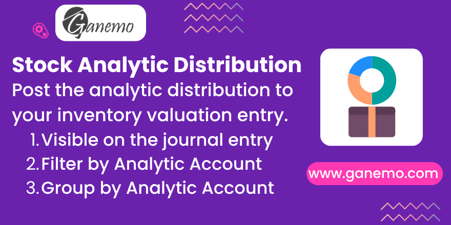

# **Stock Analytic Distribution**

Assign an **analytic distribution** to your transfers, stock moves and scraps,
post it to the inventory valuation entries the native Odoo 19 way, and analyze
your stock by analytic account.

**Author**: [Ganemo](https://www.ganemo.com)

---

## What it does

Standard Odoo does not let you carry an analytic distribution from an inventory
operation to its valuation journal entry. This module adds that capability:

- An **Analytic Distribution** field on transfers (`stock.picking`), moves
  (`stock.move`), detailed operations (`stock.move.line`) and scraps
  (`stock.scrap`).
- On products valued in **real time**, the distribution is stamped on the
  **counterpart line** of the valuation journal entry — the same mechanism Odoo
  uses for COGS lines. Posting the entry then creates and links the analytic
  items automatically. The line booked on the stock valuation account is left
  untouched.
- The **transfer header** distribution autocompletes its moves, exactly like the
  source and destination locations. Each move can still keep its own value.
- **Mandatory analytic plans** can be enforced on validation, optionally scoped
  to a specific **operation type**.
- Stock moves and operations can be **filtered and grouped by analytic account**.

### Native and safe

The module is strictly additive: it only enriches the journal items Odoo already
decided to create. If native valuation does not post an entry — for example with
**periodic (manual) valuation** — nothing is forced and no entry is created.

---

## Requirements

- Depends on `stock_account` and `analytic` (standard Odoo modules).
- The analytic distribution reaches the accounting only for product categories
  configured with **Automated (real time)** valuation.

## Configuration

1. In **Accounting → Configuration → Settings**, enable **Analytic Accounting**.
2. Set the relevant product categories to **Automated (real time)** valuation
   and configure their stock valuation account, as in standard Odoo.
3. Go to **Accounting → Configuration → Analytic Plans**, open a plan and, in the
   **Applicability** tab, add a line for the **Stock Move** domain:
   - Set **Applicability** to *Optional*, *Mandatory* or *Unavailable*.
   - Optionally set an **Operation Type** to restrict the rule to receipts,
     deliveries, internal transfers, etc. A rule scoped to an operation type only
     applies to that operation type, and a more specific match wins over a generic
     stock-move rule.

## Usage

1. Open a draft transfer. Set the **Analytic Distribution** on the header to
   autocomplete every line, or type it directly on a move line, in the detailed
   operations, or on a scrap.
2. Validate the transfer (or the scrap).
3. If a mandatory plan is configured and the distribution is missing, validation
   is blocked with a message that **names the product** requiring a 100%
   distribution.
4. Open the inventory **valuation journal entry**: the counterpart line shows the
   analytic distribution. The corresponding **Analytic Items** are available under
   **Accounting → Reporting → Analytic Items**.
5. On the stock moves and operations views, use the **Analytic Account** filter
   and group-by to analyze your inventory.

---

## Frequently asked questions

**The distribution is empty on my valuation entry.**
Only products valued in real time post a valuation entry. With periodic valuation
Odoo does not create one, and neither does this module — that is the native
behavior, respected on purpose.

**Where is the analytic information stored?**
On the counterpart line of the valuation journal entry, and as standard
`account.analytic.line` records (Analytic Items), created by Odoo's posting flow.

**Can a move differ from the transfer header?**
Yes. The header only autocompletes the lines, like the locations. Each move keeps
its own distribution.

**Is it multi-company?**
Yes. Valuation accounts and journals are resolved per company.

---

## License

Odoo Proprietary License v1.0 (OPL-1). See the `LICENSE.txt` file.

© 2026 [Ganemo](https://www.ganemo.com). All rights reserved.
