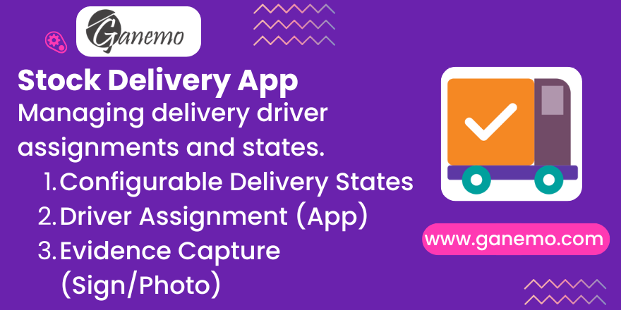

# **Stock Delivery Portal Backend**

**Author**: [Ganemo](https://www.ganemo.com)

## **Overview**
The **Stock Delivery Portal Backend** module provides the essential infrastructure for managing delivery operations within Odoo. It is designed to work seamlessly with a frontend portal (or PWA) to enable drivers to view their assigned deliveries, update status in real-time, and capture proof of delivery (signatures and photos). 

This module ensures that all delivery logic—states, requirements, and automations—is centralized and configurable in the Odoo backend.

---

## **Key Features**

### **1. Configurable Delivery States**
Create custom delivery workflows (e.g., *Pending -> En Camino -> Entregado*). Each state can be configured with specific requirements:
- **Require Signature**: Forces the driver to collect a signature before moving to this state.
- **Require Photo**: Forces the driver to upload photo evidence.
- **Require Receiver Name**: Mandatory receiver name input.
- **Result Type**: Classify states as *Success*, *Partial Information*, or *Failure*.
- **Font Awesome Icons**: Assign visual icons to each state for better UX recognition (e.g., truck icon for "En Camino", check-circle for "Entregado").

### **2. Driver Assignment & Contact Management**
Assign stock pickings (Delivery Orders) to specific drivers (Partners/Portal Users).
- **Privacy First**: Drivers only see pickings assigned to them.
- **Multi-Company**: Supports multi-company environments with company-specific states and rules.
- **Driver Phone Contact**: Store and display driver contact phone with auto-fill from partner information.
- **Contact Permissions**: Control whether drivers' phone numbers are visible in the portal via operation type settings.
- **Multi-Channel Contact**: Enables drivers to receive calls, SMS, or WhatsApp messages directly from the portal interface (subject to permission settings).

### **3. Flexible Portal Configuration**
Operation types can be configured to control portal visibility and features:
- **Show Items Section**: Toggle visibility of delivery items (products) in the portal view.
- **Allow Driver Contact**: Enable/disable contact buttons (call, SMS, WhatsApp) for end customers to reach drivers.

### **4. Security & Privacy Controls**
- **Hide from Portal**: Mark specific pickings as hidden from the portal view.
- **Result State Final Actions**: Automatically hide action buttons (finalize, update status) once a delivery reaches a final state.

### **5. Automated Notifications**
Keep your customers informed automatically.
- **Email & WhatsApp templates**: Link templates to delivery states.
- **Trigger**: When a state changes (e.g., to "On Way"), the system automatically sends the configured message.

### **6. Evidence Capture**
All data collected by the driver is stored directly on the `stock.picking` record:
- **Signature**: Stored as a binary field.
- **Receiver Name**: Text field.
- **Notes**: Any additional comments from the driver.
- **Photos**: Attached as standard Odoo attachments.
- **Smart Image Compression**: Photos are automatically compressed to WebP format (1024x1024px) to minimize storage and bandwidth.

---

## **Configuration Guide**

### **Step 1: Configure Delivery States**
Go to **Inventory > Configuration > Delivery States**.
You will see default states like:
- **Pending** (with ⏰ icon)
- **On Way** (En Camino, with 🚚 truck icon)
- **Delivered** (Entregado, with ✓ check-circle icon)
- **Failed** (Ausente, No Entregado, with ✗ times-circle icon)

**To create or modify a state:**
1. Click **New**.
2. **Name**: e.g., "Arrived at Customer".
3. **Sequence**: Determines the order in the list.
4. **Font Awesome Icon**: Select a Font Awesome icon class (e.g., `fa-truck`, `fa-check-circle`) to display visually in the portal.
5. **Is Result State**: Check if this is a final state (no further updates allowed).
6. **Requirements**: Check *Require Signature*, *Require Photo*, or *Require Receiver Name* if needed, and configure the mandatory field message.
7. **Automation**: Select a *WhatsApp Template* or *Email Template* to send a notification when this state is reached.
8. **Legal Text**: Add any disclaimer or legal text that should be displayed to drivers when they reach this state.

### **Step 2: Configure Operation Types (Picking Types)**
Go to **Inventory > Configuration > Operation Types**.
1. Open the operation type used for deliveries.
2. Click the **Delivery Portal** tab.
3. **Show Items Section**: Toggle ON to display the list of items (products) being delivered in the portal. Toggle OFF to hide items and only show delivery summary.
4. **Allow Driver Contact**: Toggle ON to enable contact buttons (phone call, SMS, WhatsApp) for customers to reach the driver. Toggle OFF to remove these buttons (privacy mode).

### **Step 3: Assign Drivers**
1. Go to **Inventory > Delivery Orders**.
2. Open a picking.
3. In the **Delivery** section, find the following fields:
   - **Delivery Driver**: Select the user/partner who acts as the driver.
   - **Driver Contact Phone**: Auto-populated from the driver's partner record, but can be manually edited.
   - **Hide from Portal**: Check to hide this picking from the delivery portal (useful for test orders or sensitive deliveries).

---

## **Usage / Workflow**

### **For the Logistics Manager**
1. Create a Delivery Order (Stock Picking).
2. Set **Picking Type** to a type with delivery portal enabled.
3. Assign a **Delivery Driver** and verify **Driver Contact Phone** is populated correctly.
4. Optionally toggle **Show Items Section** and **Allow Driver Contact** in the operation type based on your needs.
5. Validate the picking. *Note: The portal logic typically operates on pickings in 'Ready' or 'Done' status, depending on your stock flow.*

### **For the Driver (Portal View - Home Screen)**
1. Driver logs in to the Portal.
2. Sees a list of assigned deliveries categorized by *Today*, *Future*, or *Past*.
3. Each delivery card displays:
   - Delivery state with its **Font Awesome icon** for quick visual recognition.
   - Customer name and address.
   - Contact buttons (if **Allow Driver Contact** is enabled):
     - **📞 Call**: Initiates a phone call to the driver's contact phone.
     - **💬 SMS**: Opens SMS compose window with driver's phone.
     - **📱 WhatsApp**: Opens WhatsApp with driver's phone (requires international format).

### **For the Driver (Portal View - Detail Screen)**
1. Opens a delivery by clicking on it.
2. Views complete delivery information:
   - Customer address with an interactive **Map Selector** button.
   - Contact buttons (call, SMS, WhatsApp) if permitted.
   - **Items Section** (visible only if **Show Items Section** is enabled for the operation type) showing products and quantities.
3. Can select from **4 map applications**:
   - **Google Maps**: Works worldwide, best for navigation.
   - **Apple Maps**: For iOS/macOS users.
   - **Waze**: For real-time traffic and routing.
   - **OpenStreetMap**: Privacy-focused alternative.

### **Workflow Steps**
1. Driver updates status to **"En Camino"** (On Way).
   - Triggers WhatsApp/Email notification to customer.
   - Contact buttons remain visible (state not final).
   - Update button remains active (not a result state).

2. Driver arrives at destination.
   - Updates status to **"Entregado"** (Delivered) or another final state.
   - If state requires **Photo**: Driver captures proof with smart compression (WebP, 1024x1024px).
   - If state requires **Signature**: Driver provides digital signature.
   - If state requires **Receiver Name**: Driver enters who received the package.
   - Driver can add optional **Notes** for additional context.

3. Driver clicks **Finalize**.
   - Hidden automatically once state reaches a **Result State**.
   - Submission triggers customer notification.

### **Result**
- The Picking in Odoo Backend updates its **Delivery State** to final state (e.g., "Entregado").
- **Signature**, **Receiver Name**, **Photos**, and **Notes** are saved.
- **Date Done** is recorded.
- Customer receives delivery notification via configured template (WhatsApp/Email).
- Driver's contact information is stored (and viewable by customers if permitted).

---

## **Technical Details**

- **Dependencies**: `stock`, `mail`, `whatsapp`, `portal`, `portal_app_launcher`, `stock_picking_extras`.
- **New Models**: `stock.delivery.state`.
- **Extended Models**: `stock.picking`, `stock.picking.type`.
- **Models**:
  - **stock.delivery.state**: Central configuration for delivery workflow states
    - Fields: name, sequence, icon (Font Awesome class), require_signature, require_photo, require_receiver_name, is_result_state, legal_text, email_template_id, whatsapp_template_id, and mandatory field messages.
  - **stock.picking** (extended): 
    - New fields: delivery_phone (driver contact), hide_from_portal (security toggle).
    - Auto-fill behavior: Driver phone populates from assigned partner when changed.
  - **stock.picking.type** (extended): 
    - New fields: delivery_portal_show_items (toggle items visibility), allow_driver_contact (toggle contact buttons).
- **Frontend (PWA)**:
  - Smart image compression: WebP format, 1024x1024px max, 0.6 quality.
  - Map selector: Supports 4 applications with coordinate validation.
  - Responsive design: Bootstrap grid with Font Awesome icons.
- **Security**: 
  - Record rules ensure drivers strictly access their own records.
  - `sudo()` used only for reading system configuration (safe for portal).
  - Phone and contact permissions controlled via operation type settings.
- **Localization**: Spanish (es.po) translations included for all fields and help text.
- **License**: OPL-1.

---

## **Field Reference**

### **stock.delivery.state Fields**
| Field Name | Type | Required | Purpose |
|---|---|---|---|
| name | Char | Yes | State name (e.g., "Delivered") |
| sequence | Integer | No | Order in lists |
| icon | Char | No | Font Awesome class (e.g., "fa-check-circle") |
| require_signature | Boolean | No | Requires driver signature |
| require_photo | Boolean | No | Requires photo evidence |
| require_receiver_name | Boolean | No | Requires receiver name |
| is_result_state | Boolean | No | Mark as final state (locks updates) |
| require_signature_mandatory_message | Char | No | Message shown when signature required |
| require_photo_mandatory_message | Char | No | Message shown when photo required |
| require_receiver_name_mandatory_message | Char | No | Message shown when name required |
| legal_text | Text | No | Legal disclaimer/info for state |
| email_template_id | Many2one | No | Email notification template |
| whatsapp_template_id | Many2one | No | WhatsApp notification template |

### **stock.picking Fields (New)**
| Field Name | Type | Purpose |
|---|---|---|
| delivery_phone | Char | Driver contact phone (auto-filled from partner, editable) |
| hide_from_portal | Boolean | Hide picking from portal view (default: False) |

### **stock.picking.type Fields (New)**
| Field Name | Type | Purpose |
|---|---|---|
| delivery_portal_show_items | Boolean | Show items/products in portal (default: True) |
| allow_driver_contact | Boolean | Enable contact buttons for customers (default: True) |

---

## **Support**
For support or customization requests, please contact [Ganemo](https://www.ganemo.com).
