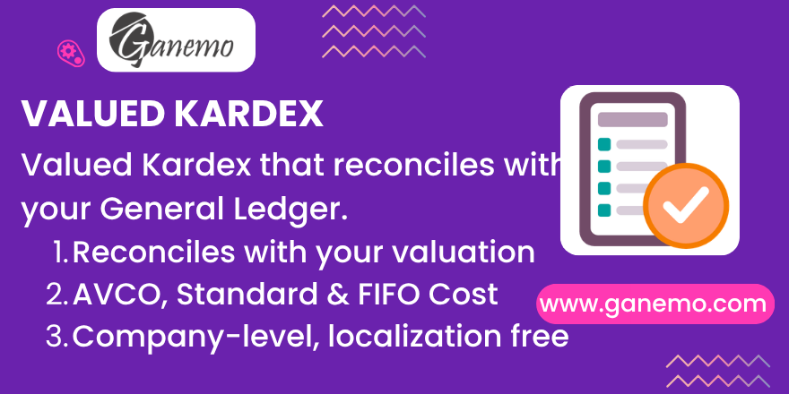

# **Stock Kardex Valued**

A **valued inventory Kardex** (moving ledger) for Odoo 19 that is **correct**: its running
balance reconciles with your **stock valuation General Ledger** (`product.total_value` =
`quant.value`). It works at **company level**, is fully **generic** (no dependency on any
localization / SUNAT), and supports the **three cost methods**: Average (AVCO), Standard and FIFO.

**Author**: [Ganemo](https://www.ganemo.com)

---

## Why this module

Traditional stock ledgers (including the SUNAT PLE 12.1 / 13.1) add up `sum(move.value)`.
That figure **drifts away from the General Ledger** whenever a cost is set or changed *after*
the movement — landed costs, manual revaluations, backdated receipts, production costed later.
The result: an inventory book that does not tie out to Accounting.

`stock_kardex_valued` instead **re-simulates the unit cost** with the *same* recurrence Odoo
core uses to compute `total_value`:

- **Average** → the `_run_average_batch` / `stock.avco.report` recurrence (outgoing values are
  re-derived from the running average, not read from `move.value`).
- **Standard** → `value = quantity × standard price in force` (steps at each price change).
- **FIFO** → a layer queue that replicates `_run_fifo` (COGS = layers consumed).

Every run **asserts** that the closing value equals `total_value` at the cut-off date, so the
Kardex agrees with the Inventory Valuation shown in Accounting.

---

## Key features

- **Reconciled with the GL** at company level (one cost per product/company, exactly like Odoo
  values stock).
- **Three cost methods** with a per-method engine; a `cost_method` filter to audit one method in
  isolation.
- **Populated-per-run report** + a wizard: free period (defaults to last month), Product /
  Category / Cost-Method filters, and a **volume traffic-light** so large scopes never freeze the
  server.
- **List** view grouped Template → Product (opening / in / out / running balance / closing) and a
  **Pivot** view for multi-dimension analysis (cost method, operation type, locations, partner,
  category, month).
- **Reconciliation Delta** column: exposes, per product, the gap against a naive `sum(move.value)`
  ledger (what the PLE would show) — turning a hidden fiscal risk into an auditable figure.
- **Landed cost embedded** at receipt date (no re-dating, no double counting); **dropship**
  included; **internal transfers** excluded (they are not valuation events).
- **Per-user results**: a record rule limits each user to the rows they generated, within their
  allowed companies. Re-running **replaces** the previous result (no cron, no clutter).

---

## Requirements

- Odoo **19** (Enterprise, Odoo.SH or Ganemo Online).
- Depends on `stock_account` and `stock_landed_costs` (both standard). **No** localization module
  is required.

---

## Installation

1. Copy the `stock_kardex_valued` folder into your addons path.
2. Update the Apps list.
3. Install **Stock Kardex Valued**.

---

## Configuration

There is nothing mandatory to configure. Two optional system parameters control the volume
traffic-light (Settings → Technical → System Parameters):

| Parameter | Default | Meaning |
|---|---|---|
| `stock_kardex_valued.sync_max` | `100000` | 🟢 At or below this many history events, the report runs synchronously. |
| `stock_kardex_valued.queue_max` | `1000000` | 🔴 Above this, generation is refused with a clear message asking to narrow the scope. Between the two thresholds it still runs but warns you to narrow it. |

Access is granted to the **Inventory / User** group; each user only sees their own generated rows.

---

## Usage

1. Go to **Inventory → Valued Kardex → Generate Valued Kardex**.
2. Choose the **From / To** dates. The **opening** balance is the state at the start of *From*;
   the **closing** balance is the state at the end of *To*. The default period is the previous
   month.
3. (Optional) Narrow the scope:
   - **Products** and/or **Categories** to restrict the universe.
   - **Cost methods** — tick Average, Standard and/or FIFO. Leaving all unticked means **all
     methods**.
4. Read the **volume traffic-light** (estimated history events) and press **Generate**.
5. The results open as a **List** (grouped Template → Product) and a **Pivot**. Balances are valid
   only under the canonical Template → Product grouping; use the Pivot for dimension analysis.

### Reading the columns

- **Opening** (`ini_*`): balance carried into the period (shown once per product).
- **In / Out**: each movement's quantity, unit cost and value. Outgoing values are re-derived from
  the running cost.
- **Balance** (`bal_*`): running quantity / unit cost / value after each line.
- **Closing** (`fin_*`): balance at the end of the period (shown once per product); it equals the
  Inventory Valuation at the *To* date.
- **Revaluation** lines appear when a product's cost/standard price changes inside the period, with
  the value delta.
- **Reconciliation Delta** (`recon_delta`): `balance − PLE-style balance`. A non-zero value means
  the official PLE (`sum(move.value)`) diverges from the GL for that product. Use the
  *"Diverges from PLE"* filter to review them.

---

## How it works (technical)

- The engine reads the **event universe** once (valued `stock.move` with `is_in` / `is_out` /
  `is_dropship`, plus `product.value` revaluations with `move_id = NULL`), using the core
  `move._get_valued_qty()` for quantities — the exact source `_run_average_batch` uses.
- It then **replays** those events in pure Python (ordered by `product, date, source_rank, id`,
  moves before same-date revaluations) accumulating state per product, and bulk-inserts the period
  rows.
- Period boundaries are converted to the **company timezone** before filtering.
- Products valued by **Lot/Serial** are excluded (their valuation is per lot, not by the replay).

---

## Scope & notes

- The balance is at **company level**; the warehouse is a **referential label**, never the basis
  of the balance.
- This module is intentionally **independent** of the SUNAT PLE report: it builds the *correct*,
  GL-reconciled Kardex even where it differs from the official `.txt`. That divergence is surfaced
  as the `recon_delta` audit column, not hidden.
- For products under Average costing, at a **past** cut-off with no captured price history, Odoo's
  own `total_value` may fall back to the current standard price; the module always reconstructs the
  historical value from `move.value`, which is the value the General Ledger actually held.

---

## Demo data (learn by example)

Install the module **with demo data** (the default on a trial / Odoo.SH development build) and
you get a ready-made, 100% synthetic dataset (~490 movement rows over 26 products/variants,
with **several movements in every month Jan–Jun 2026** so any period you pick is busy) built to
teach every feature of the report. It creates three product categories — **Demo Kardex / AVCO**,
**/ FIFO**, **/ Standard** — and a set of products whose *names are the lesson*:

| Product | What it teaches |
|---|---|
| **AVCO 01 – Moving Average** | Average recomputed on each receipt; outs leave at the running average. |
| **AVCO 02 – Cost Adjustment (revaluation)** | A manual cost adjustment re-bases the average and emits a *Revaluation* line; `recon_delta` turns non-zero (PLE diverges from the GL). |
| **AVCO 03 – Sale before Purchase (negative)** | Stock goes negative; the next receipt re-bases the average. |
| **AVCO 04 – Landed Cost embedded** | Freight loaded into the receipt value (unit cost arrives already loaded). |
| **AVCO 05 – Dropship** | Supplier → customer: value-neutral, on-hand untouched. |
| **AVCO 06 – Multi-period** | Two receipts months apart: run month by month to see *closing(N) = opening(N+1)*. |
| **AVCO 07 – Busy item** | Many movements so the running-balance column really moves. |
| **FIFO 01 – Layer queue** | Layers consumed oldest-first (COGS = layers used). |
| **FIFO 02 – Negative extrapolation** | Out with no stock extrapolates the last known / standard cost. |
| **FIFO 03 – Multi-layer partial** | A single out partially consuming several layers. |
| **FIFO 04 – Busy item** | Dense FIFO history. |
| **STD 01 – Standard cost** | `value = qty × standard price`. |
| **STD 02 – Standard price change** | A mid-period price change emits a *Revaluation* line for the on-hand qty. |
| **STD 03 – Busy item + price change** | Dense standard history with a price step. |
| **AVCO 08 / FIFO 05 / STD 04 – Monthly activity** | Several receipts and deliveries **every month** (Jan–Jun, ~36 rows each) so the running average / FIFO queue / standard value can be followed as the cost moves repeatedly within each month. |
| **VAR AVCO / VAR FIFO / VAR STD (S/M/L)** | Three multi-variant templates (a Size attribute → 3 variants each), every variant with its own monthly history — to study the canonical **Template → Variant grouping**: expand a template to see each size accumulate its own balance while the header totals the additive columns. |

All activity is dated **January–June 2026** with movements in **every month**, so even the wizard's
default period (previous month) shows real movements. To see everything at once, run *Generate
Valued Kardex* with **From = 2026-01-01, To = 2026-06-30** and all cost methods. Group by *Cost
Method* or *Product Category*, or open a **VAR …** template to see the Template → Variant grouping.
Every demo product **reconciles with the General Ledger** (closing value = `total_value`).

---

## Support

- **Sales**: leads@ganemo.com
- **Technical support**: ayuda@ganemo.com
- **Website**: [ganemo.com](https://www.ganemo.com)

© 2026 Ganemo. All rights reserved.
