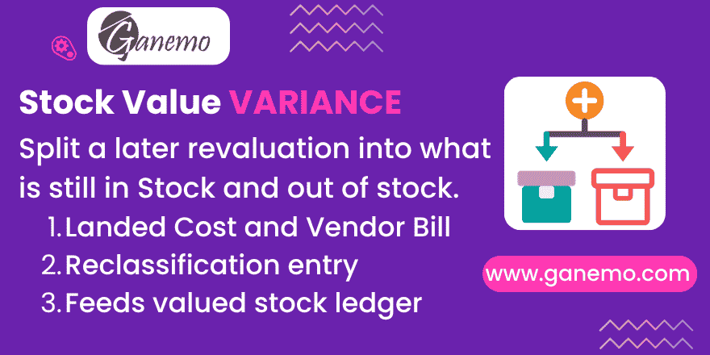

# **Stock Value Variance**



When a landed cost or a vendor bill revalues a receipt **after** part of the goods have already left, Odoo 19 adds the whole amount to the movement's value but capitalises only the part still in stock — and posts **nothing at all** when nothing is left. The remainder stays in the freight expense account, unidentified.

This module **records that remainder, movement by movement**, and turns it into an explicit journal entry backed by a supporting schedule. It creates **no stock move**, and never rewrites the value of a validated movement.

It depends on **Landed Costs** and **Purchase** only: no localization, any chart of accounts.

---

## The problem, measured

Receipt of 5 units at 500 = 2 500. Three units are sold. A landed cost of 250 is applied afterwards.

| Magnitude | Odoo 19 | Correct |
|---|---|---|
| Value of the receipt | **2 750** (the whole amount) | — |
| Journal entry of the landed cost | Dr valuation 100 / Cr expense 100 (only the remaining 2/5) | — |
| `standard_price` | 550 ✔ | 550 |
| `total_value` | 1 100 ✔ | 1 100 |
| Sum of a movement-level ledger | **1 250** | 1 100 |

The engine's own figures are right. What is wrong is that **150 — the share of the freight belonging to the three units already sold — has nowhere to sit**: it inflates the ledger, it is missing from cost of sales, and no line anywhere identifies it. Sell the last two units and the ledger keeps a residue of 150 against a quantity of zero. Every import leaves its own, and they accumulate.

The same happens with a vendor bill: posting it re-values the receipt (measured: 2 500 → 2 800), and the units delivered before that point stay recognised at the old cost.

---

## What this module records

One row of **`stock.value.variance`** per (movement, revaluation event):

| Field | Meaning |
|---|---|
| **Revaluation** | The whole amount that revalued the movement. |
| **Capitalised** | The part that landed on goods still in stock. |
| **Belongs to Goods Gone** | The part attributable to goods that had already left. |
| **Origin** | Landed Cost, Vendor Bill, or Valuation Recalculation. |
| **Date** | The date of the event that revalued the movement — not the movement's own date. |
| **Valued Qty / Remaining Qty** | The basis of the split, both in the product's unit. |
| **Ledger Effect** | The signed amount the row contributes to a valued stock ledger. |
| **Absorbed** | A valuation recalculation already folded this row into the values. |
| **Reclassification Entry** | The journal entry that recognised it. |

The three amounts always add up: a database constraint enforces `Revaluation = Capitalised + Belongs to Goods Gone` within the currency's rounding.

### Where it is captured

* **Landed cost** — after `button_validate`. Not before: the native method creates the adjustment lines itself when the user validates without pressing Compute, so there would be nothing to read.
* **Vendor bill** — around `_post`, by comparing the movement's value before and after. That is the only way to know what the movement was worth before the bill moved it.

### How the split is derived

By calling the FIFO stack directly (`_run_fifo_get_stack`), **never** `move.remaining_qty`. The native remaining dictionary mixes units within itself — the oldest entry in the product's unit, the rest in the movement's unit — so a receipt booked in kilos against a product stocked in grams would yield a ratio off by the conversion factor. Rebuilding from the stack gives the same numbers the core used for its own entry, in one consistent unit.

**Lot-valuated products** get one row per lot, from the same stack, with the rounding residue landing on the largest row so the rows still add up to the cost line.

---

## Configuration

**Inventory → Configuration → Product Categories → Value Variance Accounts** (visible to accounting managers).

| Field | What it does |
|---|---|
| **Variance: Stock Valuation** | The inventory account debited/credited when a variance is reclassified. Usually your stock valuation account. |
| **Variance: Inventory Variation** | The counterpart used when the variance came from a landed cost. |
| **Variance: Cost of Sales** | Where the variance is finally recognised. |

Three deliberate design decisions:

1. **They are declared, never inferred.** The native field names do not carry their accounting role — on the Peruvian chart, `account_stock_variation_id` points at a cost of sales account and `account_stock_expense_id` at an inventory variation account, the opposite of what the names suggest. Guessing from a field name is how a reclassification lands on the wrong side of the P&L.
2. **No silent fallback.** If an account is missing, posting stops and names it.
3. **Accounts swept by the periodic closing are refused.** The native closing reads the raw balance of whatever account sits in `account_stock_variation_id` and nets it out, so an entry posted there would be cancelled line for line by the next closing — silently. The module checks and refuses.

When you set the category's stock valuation account, the module **proposes** the same account for *Variance: Stock Valuation*. It never applies anything silently.

---

## The reclassification entry

Select the variance rows and run **Post reclassification**. It is a deliberate action, never a hook inside `button_validate` or `_post`: an exception because the period is locked must never make it impossible to validate a landed cost or post a bill. Lock dates are validated before posting, and violations are named.

**Origin: landed cost** — the amount never entered inventory, it stayed in the freight expense account, so it goes in and out:

```
Dr  Stock Valuation      belongs-to-goods-gone
Cr  Inventory Variation  belongs-to-goods-gone
Dr  Cost of Sales        belongs-to-goods-gone
Cr  Stock Valuation      belongs-to-goods-gone
```

**Origin: vendor bill, perpetual valuation** — the bill's own entry already moved the valuation account, so the amount only has to come out:

```
Dr  Cost of Sales        belongs-to-goods-gone
Cr  Stock Valuation      belongs-to-goods-gone
```

**Origin: vendor bill, periodic valuation — no entry.** The native closing drives the valuation account to `total_value` and the cost of sales follows implicitly; posting on top would move the result twice. The row is still recorded, for the ledger.

**None of these entries changes the result of the period. They reclassify.**

One **aggregated entry per company**, grouped by origin and product category. The variance rows are its supporting schedule — the sum is the amount, each row a line of the working paper — and the link is kept in both directions.

### Guarantees

* **Idempotent and concurrency-safe.** The marker is the *Reclassification Entry* on the variance row, a model nothing in the core deletes, and the sweep locks its rows (`SELECT … FOR UPDATE`) before posting.
* **Recomputing a validated landed cost is refused.** The native `compute_landed_cost` is public, RPC-callable and has no state guard, and it opens by unlinking every line of the cost — which would strip the link between a posted entry and the rows that justify it.
* **Editing is paired and bounded.** *Belongs to Goods Gone* is editable by accounting managers; the capitalised half is recomputed so the split always adds up, the change is tracked in the chatter, and it is refused once the entry is posted (reverse the entry first).

---

## What it deliberately does not do

* **It creates no stock move.** Value-only movements were evaluated and discarded with evidence: the average-cost engine does not read the value of an exit without quantity, FIFO drops an entry without quantity deterministically, `_action_done` cancels quantity-less moves, and the residue changes sign instead of disappearing.
* **It rewrites no validated value.** Valuation, average cost and standard price are exactly what native Odoo produced. Uninstall it and nothing about your valuation changes.
* **It does not fix a movement pinned by a manual valuation adjustment.** When a `product.value` pins a movement, the landed cost never reached its value at all, so there is nothing to give back. That case is written to the server log with the movement and the cost — it is never skipped in silence.

---

## Companion modules

| Module | What it adds |
|---|---|
| `stock_landed_cost_variance_kardex` | Feeds the recorded variances into the movement-level Kardex columns. Installs itself when both sides are present. |
| `l10n_pe_reports_stock_transfer_document` | Shows the decrease as its own line in the Peruvian PLE 13.1 inventory book. |
| `stock_valuation_avco_recalc` | Folds variances into the movement values when you choose to restate; the rows it absorbs stop counting twice. |

---

## Operating advice

This module is a **safety net, not a process**. The problem disappears entirely if the landed cost is captured **before the first movement** of the goods, with a provisioned estimate biased slightly high, the deviation taken to profit and loss against a threshold agreed in advance, and the yearly accumulation monitored by sign. Everything a late revaluation cannot fix — the movement's own date, the period it belongs to, the intermediate unit cost — is avoided that way.

---

## Technical notes

* Odoo 19 only. `stock.valuation.layer` no longer exists: valuation lives on `stock.move` (`value`, `remaining_qty`, `is_in`, `is_out`) and on the new `product.value`.
* All the fields of `stock.value.variance` are **plain stored columns**, written once at capture. None is computed: a stored computed field depending on `move_id.remaining_qty` would rebuild the FIFO stack of every product over the whole history at install time.
* An explicit index is added on `stock.valuation.adjustment.lines.move_id`, which the core does not have.
* Any SQL write on `value`, `is_in`, `is_out` or `state` leaves stored Kardex columns stale. Recompute them through the ORM before committing — this is true with or without this module.

---

**Author**: [Ganemo](https://www.ganemo.com)

**License**: OPL-1
