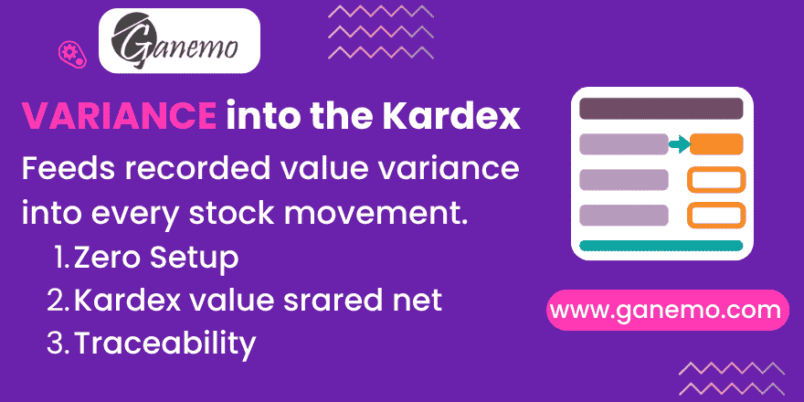

# **Stock Value Variance — Kardex Columns**

A bridge with a single job: make the movement-level Kardex columns state what each movement is **really** worth once a late landed cost or vendor bill has been recorded against it.

It installs itself when both sides are present, and there is **nothing to configure**.

---

## Why it exists as a separate module

Two modules that must not depend on each other:

| Module | Owns | Depends on |
|---|---|---|
| [`stock_move_kardex_qty`](../stock_move_kardex_qty) | The Kardex columns on `stock.move` | `stock_account` **only** |
| [`stock_landed_cost_variance`](../stock_landed_cost_variance) | The `stock.value.variance` model | `stock_landed_costs`, `purchase_stock` |

Making the columns depend on the variance model would force **Landed Costs** onto every install of a generic ledger column. So the columns call a hook that returns nothing by default, and this bridge — installed automatically when both sides are present — supplies the real source and, just as importantly, **declares the dependencies that keep the columns fresh**.

Without it, the Kardex columns behave exactly as they did before.

---

## What it changes in the columns

Three columns of `stock_move_kardex_qty`, available as optional columns of the native **Inventory → Reporting → Moves Analysis** list:

| Column | With the bridge |
|---|---|
| **Kardex Value** | The signed value of the movement **net of** the corrections carried by the variances that are still live. |
| **Kardex Adjustment** | The correction on its own, so the difference between the native *Value* and what the ledger counts is explainable at a glance. |
| **Adjusted Qty** | How much had already left the warehouse when the movement was last revalued. Informative: no unit moved, so it deliberately does not aggregate. |

### The two rules that make the numbers safe

1. **Absorbed rows contribute zero.** When a valuation recalculation folds a variance into the movement values, the row is flagged *Absorbed* and stops counting. Correcting the same money twice is the classic failure of this kind of column, and it is ruled out by construction rather than by care.
2. **Every row carries its ledger effect already signed.** Nothing downstream has to know that an incoming movement gives the amount back one way and an outgoing one the other. One number, one reading.

*Adjusted Qty* takes the **most recent live** variance row, not the sum: an older row describes a warehouse state that no longer applies, and quantities measured at different moments do not add up.

---

## Configuration

None.

1. Install **Kardex Quantities & Value**.
2. Install **Stock Value Variance**.
3. This module installs itself.
4. Show *Kardex Adjustment* and *Adjusted Qty* from the optional-columns menu of the Moves Analysis list — they are hidden by default.

---

## What it does not do

* No new field, model, menu, action or view of its own — it inherits the existing list and adds two optional columns.
* No stock move, no journal entry, no valuation rewritten. The accounting side belongs to `stock_landed_cost_variance`.
* No cron and no manual refresh: the columns are recomputed by the ORM the moment a variance changes.

---

## Technical notes

* The bridge overrides `_compute_kardex_variance` only to **re-declare `@api.depends`**. Odoo resolves a computed field's dependencies through the method it finds on the class, so overriding here extends them while `super()` keeps the base ones.
* It implements `_kardex_variance_amounts()`, the hook the base module calls; the base returns `(0.0, 0.0)` when no bridge is installed.
* The Kardex columns are **stored** computed fields. Any SQL write on `value`, `is_in`, `is_out` or `state` leaves them stale — this is true with or without the bridge. Recompute them through the ORM before committing.

---

**Author**: [Ganemo](https://www.ganemo.com)

**License**: OPL-1
