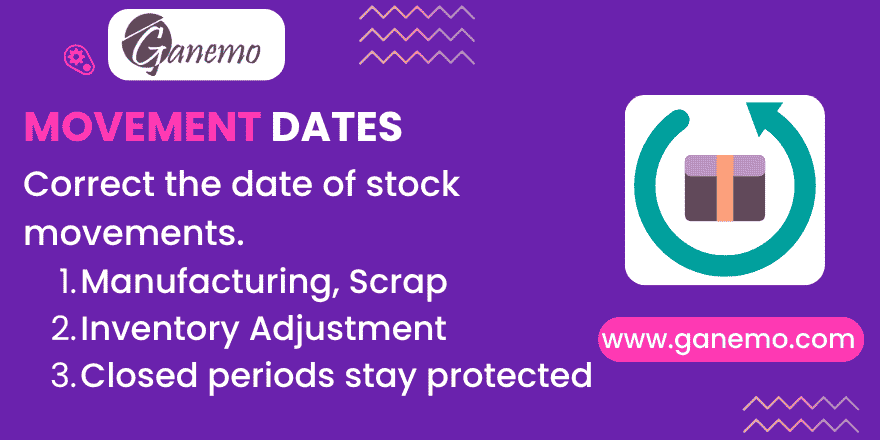

**Stock Move Date Regularisation**

Correct the date of already processed stock movements whose source document gives you
no way to edit it.

---

## Why this module exists

In Odoo 19 valuation no longer lives in a separate layer: it sits on `stock.move`
itself. The Kardex, the stock ledger and every valued inventory report read
`stock.move.date`.

A **Transfer** lets you fix that date — unlock it, change *Date of Transfer*, and Odoo
propagates it to the movements. **Nothing else does.** A Scrap, an Inventory Adjustment,
a Manufacturing Order or a Disassembly stamps its movements at processing time, and the
interface offers no way back. When you regularise historical records, those movements
stay wrong forever.

This module closes that gap with a single guided wizard.

---

## What it does

| Capability | Detail |
|---|---|
| One wizard, every origin | Resolves whatever you selected into its movements and re-dates them |
| Two modes | *Fixed date*, or *Shift* by an offset that preserves intra-day spacing |
| Staggering | Separates the phases of one document so a consumption never shares a timestamp with the output it feeds |
| Preview | Every affected movement listed and grouped by origin before you confirm |
| Warnings | Non-blocking alerts for broken chronology, non-done movements and untouched journal entries |
| Document sync | The source document's own date follows (a Transfer's *Date of Transfer*, a Scrap's *Date*). Odoo then cascades it onto the document's other movements, which are added to the selection openly and traced |
| Permanent trace | `Original Date` and `Date Regularised` on the movement, plus a chatter note with the reason |
| Restore | Puts the pre-regularisation date back |
| Hard limits | Future dates, per-company maximum shift, and closed accounting periods |
| Valuation entry | Optional, off by default: draft → renumber → re-date → post, refusing reconciled, hashed or closed-period entries |

## What it does NOT do

**It does not revalue anything.** The `value` stored on a done movement is exactly what
Odoo computed when the movement was processed, and this module never recomputes it.

Be aware, though, that re-dating is **not a cosmetic operation**. Odoo builds the FIFO
stack by querying incoming movements ordered by date. Changing dates therefore changes
which layers stay open and what future outgoing movements will cost. That is usually
precisely what you want when regularising history — but it is a real effect, not a
display change.

By default it also **leaves the valuation journal entry where it is** (see the FAQ).

---

## Installation

1. Copy the module into your addons path.
2. Update the apps list and install **Stock Move Date Regularisation**.
3. If you use Manufacturing, also install **Stock Move Date Regularisation -
   Manufacturing** (`stock_move_date_adjust_mrp`). It installs itself automatically
   when both `mrp` and this module are present.

Requires Odoo 19. Depends only on `stock`. Accounting features are soft-guarded: if
`account` / `stock_account` are not installed, the related options simply do not apply.

---

## Configuration

### 1. Grant the permission (required)

Nobody can use this until you say so — not even Inventory Administrator.

**Settings → Users & Companies → Users →** open the user **→ Movement Date
Regularisation → Allowed**.

The recommended practice is to grant it for the duration of a regularisation campaign
and revoke it afterwards. Users without the permission see **no change whatsoever** in
the interface: no field, no button, no menu entry.

### 2. Maximum shift (optional)

**Settings → Inventory → Maximum Movement Date Shift**, in days. Any regularisation that
would move a movement further than this is refused. Leave it at **0** for no limit.

---

## User guide

### Where to find it

Select one or more records and use the **Actions** menu — the gear icon next to the
record name (or the cog above a list selection).

| Model | How to get there |
|---|---|
| Stock movements | Inventory → Reporting → Moves Analysis |
| Transfers | Inventory → Operations → Transfers |
| Scraps | Inventory → Operations → Scrap |
| Manufacturing Orders | with the MRP bridge installed |
| Disassemblies | with the MRP bridge installed |

Inventory adjustments have no document of their own: reach them from **Moves Analysis**
and filter by *Inventory*.

### The wizard, field by field

- **Mode — Fixed date**: every selected movement lands on the same instant.
- **Mode — Shift**: *Move This Date* and *To This Date* are a **reference pair, not a
  range** — the movements do not travel from one to the other. Pick a date you know,
  usually the date the movements carry now, and then the date it should have been; only
  the **gap** between the two is added to every movement, so the batch keeps its internal
  spacing. *Resulting Shift* spells out what will happen ("Every movement moves 31 days
  0h 0min earlier") so you can check the direction before applying.

  Worked example: movements dated *Aug 17* that should have been *Jul 17* → set
  *Move This Date* = Aug 17 and *To This Date* = Jul 17. Entering *Jun 1* and *Jul 2*
  instead would not send anything to July: it would add **+31 days** to whatever dates
  the movements already have.
- **New Date**: the target instant in *Fixed date* mode.
- **Stagger within each document**: separates the phases of one document by one hour.
  In a Manufacturing Order, components land on the chosen instant and the finished
  product an hour later.
- **Reason**: mandatory. It ends up in the chatter note.
- **Also update the document date**: keeps the source document's header aligned. Switch
  it off to touch only the movements.
- **Also re-date the valuation entry**: off by default; only visible when the selection
  actually has journal entries. Odoo forbids writing the date of a posted entry, so this
  does the only thing Odoo allows: reset to draft, clear the number, write the date, post
  again. **The entry comes back with a new number in the target period and leaves a gap
  in the sequence of the original one.** Entries that are reconciled, hash-protected,
  not posted, or sitting in a closed period are refused before anything is written — the
  whole operation is one transaction, so a refusal leaves the movements untouched too.

Below the options, **What will change** lists every movement grouped by origin, with its
document, product, current date and target date.

### One selected movement can move its siblings — and that is shown

Writing a document's date is not cosmetic: **Odoo propagates it back to every movement
of that document** (`stock_picking.py:1146-1147` for a transfer,
`mrp_production.py:1024-1027` for a manufacturing order). Pick one line of a three-line
delivery and all three change date. That is core behaviour, not something this module
adds, and it keeps the document internally consistent.

What the module does is refuse to let it happen quietly:

- Those siblings are **added to the selection**, so the preview lists what will really
  change instead of showing one row and moving three.
- They get the **same trace** as everything else: `Original Date` and
  `Date Regularised` are written on them too.
- A warning states how many were added and why.

Precisely which siblings depends on the header field involved. In a manufacturing order,
selecting a **component** drags the other components — the order's *Start Date* cascades
onto `move_raw_ids` — but leaves the finished product alone, because that one hangs off
*End Date*, which nothing wrote.

If you want to touch **only** what you picked, untick **Also update the document date**.
The document header then keeps its own date and no sibling moves.

### Warnings

Warnings never block. They tell you:

- A movement would end up **before its own origin movement**. This is the quiet way a
  FIFO chain gets scrambled, and it is the one worth reading carefully.
- Some movements are **not done**, where the date is the *planned* date, not the
  effective one.
- Valuation entries will keep their current date.

### Auditing and undoing

- `Original Date` stores the date the movement had **before the first** regularisation.
  A second regularisation does **not** overwrite it.
- `Date Regularised` flags the movement.
- In **Moves Analysis**, filter by *Date Regularised* and enable the *Original Date*
  optional column to review everything you touched.
- Select movements and run **Actions → Restore Original Date** to put the original
  value back. The flag and the stored original are cleared.

---

## Frequently asked questions

**Does the journal entry move too?**
Not unless you tick *Also re-date the valuation entry*. Odoo sets the entry's date when
it creates it — the day you validated — and treats that date as unmodifiable afterwards,
tying it to the journal sequence. The option therefore performs the supported route:
draft → clear number → new date → post. Expect a **renumbering** and a **sequence gap**
in the original period. Entries only exist for products valued in *real time*; with
*periodic* valuation there is nothing to move.

**Why does it refuse a reconciled entry?**
Because Odoo does not. We tested it: the draft → renumber → post route goes through on a
reconciled entry without a word, which would quietly disturb the reconciliation. The
guard is ours, not Odoo's. Unreconcile first if you really need to move that entry.

**Why is a closed period blocked even when I am not touching accounting?**
Because the reason is not accounting, it is reporting. If the stock ledger for that
period has already been filed with your tax authority, adding a movement to it after the
fact is exactly the abuse this control exists to prevent. Reopen the period, correct,
and close it again — that leaves its own audit trail in Accounting.

**Why can't I launch it from the Physical Inventory screen?**
Odoo stores no link between a quant and the movements that adjusted it. Resolving one
from the other would be guesswork, and re-dating the wrong movement is the one failure
this module must not have. Use Moves Analysis with the *Inventory* filter instead.

**Does it change my costs?**
It does not recompute any stored value. It does change FIFO layer consumption going
forward, because that stack is ordered by date. See *What it does NOT do* above.

**Are movement lines updated too?**
Yes, automatically. Odoo propagates the date to the detailed operations of a done
movement on its own.

**What happens on a Disassembly?**
Its movements are re-dated like any other. The Disassembly record itself has no date
field — only the technical *Created on* stamp, which is deliberately left untouched
because falsifying when a record was created would be worse than the problem being
fixed.

---

## Technical notes

- Two new columns on `stock.move`: `original_date` and `date_adjusted`. Both are **plain
  fields** — no compute, no depends, no default — so installing on a database with
  millions of movements adds two nullable columns and triggers **no recomputation**.
- Entry points are contextual **server actions** (`binding_view_types = "list,form"`),
  so no existing form view is inherited anywhere.
- Extension points, for bridge modules:
  `stock.move._date_adjust_origin()`, `_date_adjust_stagger_rank()`,
  `_date_adjust_sync_document()`, `_date_adjust_origin_labels()`, and
  `_date_adjust_get_moves()` on any model you want to use as an entry point.
- Closed-period validation uses `res.company._get_lock_date_violations()`
  (fiscal year and hard lock only — sale, purchase and tax locks are not relevant to a
  stock movement).

---

**Author**: [Ganemo](https://www.ganemo.com)

License: OPL-1. Compatible with Odoo 19 Enterprise, Odoo.SH and Ganemo Online. Not
supported on Odoo Online (custom code restrictions).
