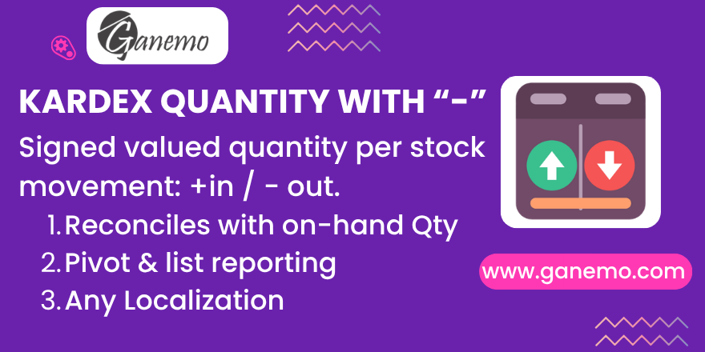

**Kardex Quantities — Signed Valued Quantity Stock Ledger for Odoo 19**

Kardex Quantities is a generic (any localization) Odoo 19 module that turns your
stock moves into an entry-level **Kardex** (stock ledger) based purely on
**quantity**. It adds one stored, aggregatable column on `stock.move` and ships a
ready-to-use Pivot + List report under **Inventory > Reporting**, so you can see,
per product, exactly how many units came in and went out — and confirm that the
running balance reconciles with what you physically hold.

---

## What it does

The module adds a single stored field, **`kardex_qty`**, to every `stock.move`:

- **`+ quantity`** when the move is an **incoming** valued move (`is_in`).
- **`− quantity`** when the move is an **outgoing** valued move (`is_out`).
- **`0`** for anything that is neither: internal transfers, dropship, and any
  move that is not in the `done` state.

Because it is a **quantity-only** ledger, it telescopes trivially:

> **Sum(kardex_qty) = Sum(in) − Sum(out) = on-hand valued quantity.**

That is the whole point. A *valued* Kardex has to replay costs to reconcile;
a quantity Kardex does not — the units simply add up. This makes it the perfect
first-level control report to verify inventory movement without touching
costing or valuation.

---

## The sign convention and the "0" cases

| Move type | `kardex_qty` |
|---|---|
| Incoming, done (`is_in`) | `+ valued qty` |
| Outgoing, done (`is_out`) | `− valued qty` |
| Internal transfer | `0` |
| Dropship | `0` |
| Any move not in `done` state | `0` |

Internal transfers and dropship do not change the on-hand quantity, so they
contribute `0`. Excluding them is what keeps `Sum(kardex_qty)` reconciled with
on-hand.

---

## Reference Unit of Measure (`kardex_uom_id`)

`kardex_qty` is computed with Odoo's **`_get_valued_qty()`** — the exact same
base Odoo uses for stock valuation. Two consequences:

1. **Consignment / non-picked lines are excluded**, just like in valuation, so
   the number matches what Odoo actually values.
2. The quantity is expressed in the **product's reference Unit of Measure** (the
   product's own `uom_id`), **not** the operational UoM of the move.

To keep this explicit and prevent silent mistakes, the module also exposes
**`kardex_uom_id`** (the product's reference UoM) right next to the quantity.
Show it in your reports so a subtotal that mixes different UoMs is *visibly*
meaningless — instead of producing a clean-looking but wrong figure.

> **Important caveat:** subtotals of `kardex_qty` are meaningful **only within a
> single product** (or a group whose members all share the same reference UoM).
> Do not read a grand total across products in different UoMs as a real quantity.

---

## Where to find it

After installing the module, go to:

**Inventory → Reporting → Kardex (Quantities)**

The action opens on **done** moves, grouped by product by default.

### Pivot view
- Rows: **Product** (add Date, Location, etc. as you like).
- Measure: **Kardex Qty** (already signed, so it sums to the net movement).
- Read the per-product total as the net change in on-hand quantity.

### List view
- Columns: Date, Reference, Product, **Kardex Qty** (with a column sum),
  **Kardex UoM**.
- Read-only report (no create / edit / delete).

### Search & filters
- Filter by **Product** or **Reference**.
- Quick filters: **Incoming** (`is_in`) and **Outgoing** (`is_out`).
- Group by **Product** or by **Date (month)**.

---

## Setup

1. Install **Kardex Quantities** (`stock_move_kardex_qty`).
2. The field is stored and computed automatically for existing and new moves —
   no configuration needed.
3. Open **Inventory > Reporting > Kardex (Quantities)**.

**Depends on:** `stock_account`.

---

## Languages

Available in **English** and **Spanish** (`i18n/es.po`).

---

## Technical summary

- Model: `stock.move` (inherited).
- Field `kardex_qty` — `Float`, stored, `aggregator="sum"`, depends on `state`,
  `is_in`, `is_out`, move-line quantity / picked / owner, and product UoM.
- Field `kardex_uom_id` — `Many2one('uom.uom')`, related to `product_id.uom_id`,
  stored, read-only, no aggregation.
- Reporting only: no other model reads these fields; no functional side effects
  on stock or accounting.

---

**Author**: [Ganemo](https://www.ganemo.com)
