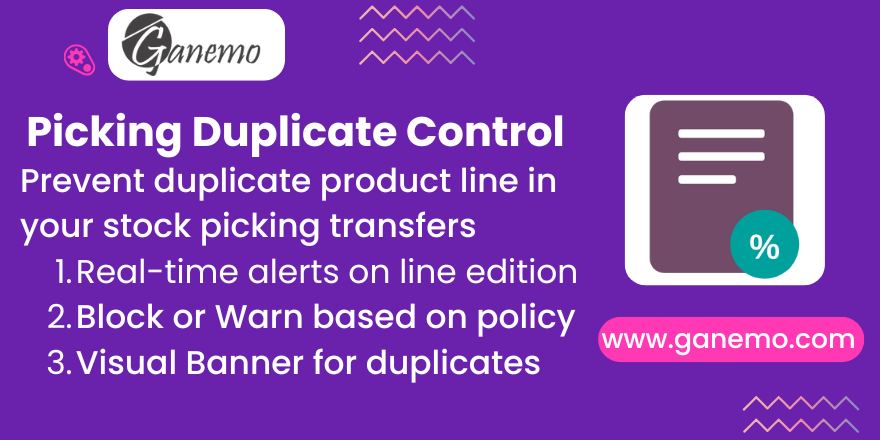

# Stock Picking Duplicate Control

**Author**: [Ganemo](https://www.ganemo.co)

## Description
This module provides a mechanism to control duplicate product lines in stock pickings (Receipts, Delivery Orders, etc.). It ensures data integrity by preventing or warning users when they add the same product with the same description multiple times in the same transfer.

## Features
- **Configurable Policies**: Define per Operation Type whether to Allow, Warn, or Block duplicates.
- **Real-time Validation**: Receive instant alerts when modifying lines.
- **Visual Feedback**: A banner displays detected duplicates at the top of the form.
- **Security**: Database constraints prevent saving pickings with duplicates if the policy is strict.

## Configuration
1. Go to **Inventory > Configuration > Operation Types**.
2. Select the operation type you want to configure.
3. In the **Duplicate Control** section, set the `Duplicate Product Policy`.

## Support
For support, please contact us at [leads@ganemo.com](mailto:leads@ganemo.com).
