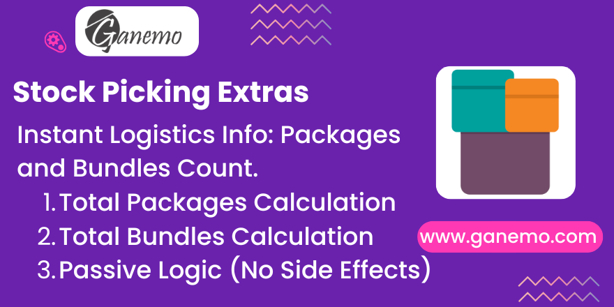

# **Stock Picking Extras**

## Overview
The **Stock Picking Extras** module extends Odoo's native stock picking functionality by providing essential logistical information at a glance. It introduces two key metrics, `Total Packages` and `Total Bundles` (Logistical Units), which are automatically calculated for every stock transfer. This module is designed to be passive and non-intrusive, ensuring that your core stock flows, reservations, and accounting remain unaffected while giving warehouse operators the data they need.

## Key Features
- **Total Packages Count**: Automatically counts the number of unique packages used in a transfer.
- **Total Bundles (Logistical Units) Count**: Calculates the total handling units.
- **Passive Logic**: Purely informative fields that do not alter stock availability or workflows.
- **Multi-Company Support**: Fully compatible with multi-company environments.
- **Read-Only Information**: Fields are displayed as read-only to ensure data integrity based on operation lines.

## Detailed Logic
Understanding how "Bundles" are calculated is essential for logistics planning:
1. **Packages**: Every unique `result_package_id` in the stock move lines counts as **1 Bundle**, regardless of how many items are inside.
2. **Loose Items**: For move lines that are *not* assigned to a package, every unit of quantity counts as **1 Bundle**.
   - *Example*: If you have 10 units of "Product A" loose (no package), that equals 10 Bundles.
   - *Example*: If you pack those 10 units into "Package 001", that equals 1 Bundle.

**Total Bundles = (Count of Unique Packages) + (Sum of Quantities for Unpackaged Lines)**

## Configuration
This module is **Plug & Play**. No additional configuration is required.
- Simply install the module, and the fields will appear on your Stock Pickings.
- No settings to toggle; it works out of the box.

## Usage
1. **Create or Open a Transfer**: Go to *Inventory > Operations > Transfers*.
2. **Add Operations**:
   - Add products and assign them to packages (Destination Package) as needed.
   - Leave some items unpacked to see the "Loose Items" logic in action.
3. **View Counts**:
   - **Form View**: Navigate to the **Additional Info** tab. You will find a new section called **Logistics Counts** displaying the `Total Packages` and `Total Bundles`.
   - **List View**: These fields are also available in the main Transfers list view. If they are not visible, click the optional columns button (three dots) in the header and enable them.

## Credits
**Author**: [Ganemo](https://www.ganemo.com)
