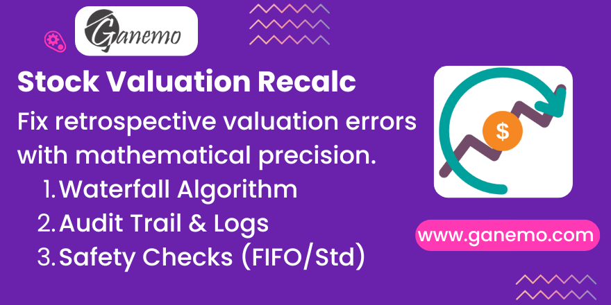

# Stock Valuation Recalculation (AVCO)

**Fix retroactive valuation errors with mathematical precision.**

This Odoo 19 module implements a robust **Waterfall Algorithm** to recalculate the Average Cost (AVCO) of a product from a specific point in time, correcting inconsistencies caused by backdated stock moves or edits.

---

## 🚀 Key Features

*   **Waterfall Recalculation**: Replays stock history sequentially to propagate the correct cost from the past to the present.
*   **Audit Trail**: Logs every recalculation event (User, Date, Value Change) for full traceability.
*   **Safety First**: Automatically blocks execution on products using **FIFO** or **Standard Price** to prevent data corruption.
*   **Zero Accounting Spam**: Updates the *Operational Valuation* in `stock.move` without generating thousands of journal entries.
*   **God Mode Wizard**: Allows manual override of "Initial Balance" for products with corrupted history.

## 🛠️ Configuration

No complex configuration is required. The module works out-of-the-box upon installation.

1.  Ensure your user has **Inventory / Administrator** permissions.
2.  Go to **Apps** and install `Stock Valuation Avco Recalc`.

## 📖 User Manual

### How to Recalculate Valuation

1.  Navigate to **Inventory > Reporting > Moves Analysis**.
2.  Filter the list by the **Product** you want to fix.
3.  Select the `stock.move` lines that appear incorrect or start from the date of the retroactive edit.
4.  Click on **Action (Gear Icon) > Recalculate AVCO Valuation**.
5.  A Wizard will open showing the **Initial Balance** (Snapshot at Start Date).
    *   *Optional*: If the snapshot seems wrong, you can manually edit the `Initial Qty` and `Initial Value`.
6.  Click **Confirm & Execute**.

### Investigating Changes

After execution, the system redirects you to the **Audit Log**:
*   Review the `value_correction_total` to see the total monetary adjustment applied.
*   Check the `moves_affected_count` to see how many future deliveries were corrected.

## ⚠️ Important Notes

*   **Scope**: This module affects `stock.move` records. It does **not** modify posted Account Moves (Journal Entries).
*   **Performance**: The SQL Genesis calculation is optimized for high-volume databases.

## 👥 Credits

**Author**: [Ganemo](https://www.ganemo.co)
**Maintainer**: Ganemo
