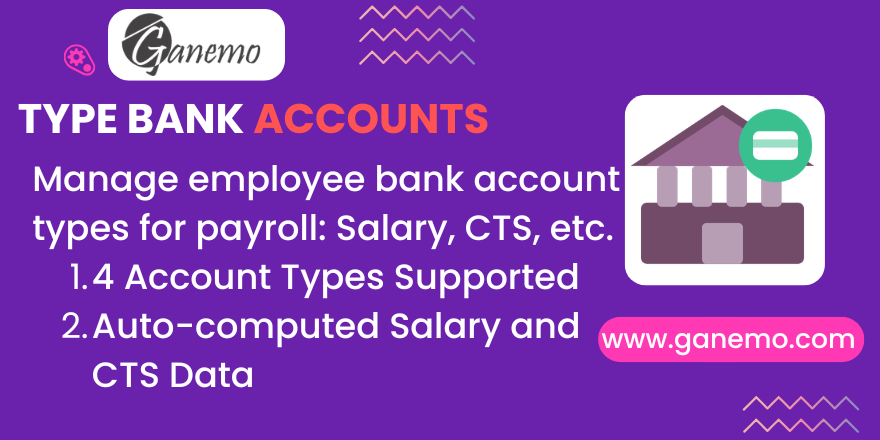

# **Type Bank Accounts**

## Overview

**Type Bank Accounts** is an Odoo 19 module that extends the standard bank account form (`res.partner.bank`) to support **4 specific account type classifications** designed for payroll-intensive HR environments:

| Type | Key | Description |
|---|---|---|
| Normal | `bank` | General-purpose account (default) |
| Salary | `wage` | Monthly salary disbursement account |
| CTS | `cts` | Compensación por Tiempo de Servicios account |
| Others | `other` | Flexible catch-all for special-purpose accounts |

Once bank accounts are classified, the **employee form** automatically surfaces the salary and CTS account information in the **Payments** group — no manual re-entry required.

---

## Features

- ✅ Overrides `_get_supported_account_types()` to expose 4 payroll-relevant account types
- ✅ Adds `Account Type` selection field to `res.partner.bank`
- ✅ Adds `Type Code` field (branch/bank code) to `res.partner.bank`
- ✅ Adds `CCI` field (Código de Cuenta Interbancaria) to `res.partner.bank`
- ✅ Auto-computes `Salary Account`, `Salary Bank`, `CTS Account`, `CTS Bank` on `hr.employee`
- ✅ Full English & Spanish translations included

---

## Installation

1. Copy the `type_bank_accounts` folder into your Odoo `addons` directory.
2. Update the apps list in Odoo (Settings > Update App List).
3. Search for **"Type Bank Accounts"** and click **Install**.

**Dependencies:** `hr` (standard Odoo Human Resources module)

---

## Configuration

### Step 1 — Add Bank Accounts to Employee

1. Go to **Employees** → select an employee.
2. Navigate to the **Private Information** tab.
3. In the **Save & Edit** bank accounts section, add or open a bank account.

### Step 2 — Set the Account Type

For each bank account, set the **Account Type** field:

- Select **Salary** → this account number and bank will appear in the Payments group as *Salary Account* and *Salary Bank*.
- Select **CTS** → this account will appear as *CTS Account* and *CTS Bank*.
- Select **Normal** (default) or **Others** for general or special-purpose accounts.

### Step 3 — Optional Fields

- **Type Code**: Fill in the bank's internal branch or account type code (used in LatAm banking integrations).
- **CCI**: Fill in the 20-digit inter-bank account code (Código de Cuenta Interbancaria) for cross-bank transfers.

---

## Usage — Payments Section on Employee Form

Once bank accounts are typed, navigate to the employee's **Private Information** tab. Under the **Payments** group, you will see:

| Field | Source |
|---|---|
| Salary Account | Account number of the `wage`-typed bank account |
| Salary Bank | Bank name of the `wage`-typed bank account |
| CTS Account | Account number of the `cts`-typed bank account |
| CTS Bank | Bank name of the `cts`-typed bank account |

> **Note:** These fields are read-only and computed automatically. They update whenever the employee's bank account records are saved.

---

## FAQ

**Q: The Salary/CTS fields are empty — why?**
> No bank account has been classified as `Salary` or `CTS` yet. Go to the employee's bank account list, open the relevant account, and set its Account Type.

**Q: Can I have multiple salary accounts?**
> The module stores the last matching account found per type. It is recommended to have a single `wage` and a single `cts` account per employee.

**Q: What is the CCI field?**
> CCI stands for *Código de Cuenta Interbancaria* — a 20-digit inter-bank routing code used in Peru and other LatAm countries for cross-institution transfers.

**Q: Is this compatible with Multi-company?**
> Yes. The module uses standard Odoo inheritance and does not introduce any global state. Each company's employees manage their own independent bank accounts.

---

## Compatibility

| Item | Value |
|---|---|
| Odoo Version | 19.0 |
| Deployment | Odoo.SH, Ganemo Online, Ganemo.SH |
| Not Supported | Odoo Online (custom code restrictions) |
| Languages | English, Spanish (es, es_PE, es_MX, es_ES) |
| License | OPL-1 |

---

## Author

**Author**: [Ganemo](https://www.ganemo.co)

For commercial inquiries: [leads@ganemo.com](mailto:leads@ganemo.com)
For technical support: [help@ganemo.com](mailto:help@ganemo.com)
WhatsApp: [+1 (828) 672-6150](https://wa.me/18286726150)
