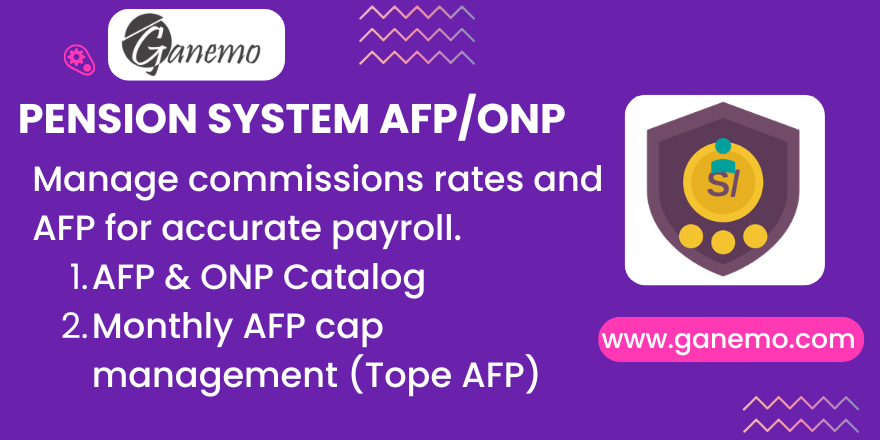

# **Peru Pension System Types**

## Overview

This module provides a complete catalog of Peruvian pension systems (SNP and AFP) for Odoo 19, fully integrated with the HR and Payroll modules. It allows managing pension types, commission rates, AFP monthly caps, and employee pension assignments — all necessary data for accurate payroll deductions.

---

## Features

- **Pension System Catalog** — Pre-loaded list of all Peruvian pension systems (SNP/AFP) with official codes, regime names, abbreviations, and sector flags (private, public, other entities).
- **Commission Rate Management** — Store historical AFP commission rates (fund, bonus, mixed-flow, flow, balance) by date range for each AFP.
- **AFP Monthly Cap (Tope AFP)** — Define the maximum monthly base for AFP deductions per period, as mandated by Peruvian regulations.
- **Employee Assignment** — Link each employee to their pension system, CUSPP code, and commission type (Balance or Flow) via the employee record.
- **CUSPP Auto-detection** — Automatically computes the `is_cuspp` flag based on whether the assigned pension system requires a CUSPP code.
- **Security by Role** — All pension fields on employee records are restricted to HR Officers only.
- **Payroll Integration** — The stored data (pension system, commission type, AFP caps) is available to payroll rules for automatic deductions.

---

## Requirements

| Dependency | Description |
|---|---|
| `l10n_pe_localization_menu` | Peru Localization menu structure |
| `hr` | Odoo Human Resources base module |

---

## Installation

1. Copy the `types_system_pension` directory into your Odoo addons folder.
2. Update the apps list in Odoo (Settings → Apps → Update Apps List).
3. Search for **"Peru Pension System Types"** and click **Install**.
4. The pre-loaded pension system data will be created automatically on installation.

---

## Configuration

### 1. Review Pension System Catalog

Navigate to **Localization → Configuration → Pension Systems** to review the pre-loaded records. Each record includes:
- **Code** — Official SUNAT/SBS code.
- **Pension Regime** — Full official name (e.g., "Sistema Nacional de Pensiones").
- **Abbreviation** — Short name used in payroll (e.g., SNP, AFP Integra).
- **Sector Flags** — Whether the system applies to Private Sector, Public Sector, or Other Entities.
- **CUSPP** — Whether affiliates of this system receive a CUSPP code.

### 2. Configure AFP Commission Rates

1. Open an AFP pension system record.
2. In the **Commissions** tab, click **Add a line**.
3. Set the **From** and **To** dates for the validity period.
4. Enter the commission values: **Fund**, **Bonus**, **Mixed Flow**, **Flow**, **Balance** (as percentages in decimal form, e.g., 0.10 for 10%).
5. Save.

> **Important:** Keep commission records up to date. Peruvian regulations (SBS) update these rates periodically.

### 3. Configure AFP Monthly Caps (Tope AFP)

1. Navigate to **Localization → Configuration → AFP Caps**.
2. Click **Create** and set:
   - **From date** — Start of the period.
   - **To date** — End of the period.
   - **Cap (Tope)** — The maximum monthly base (in PEN) for AFP contributions.
3. Save.

### 4. Assign Pension System to Employees

1. Open the employee record.
2. Go to the **Private Information** tab.
3. Configure:
   - **Pension System** — Select the applicable AFP or SNP.
   - **CUSPP** — Enter the employee's CUSPP code (required for AFP affiliates).
   - **AFP Commission Type** — Choose **Balance** or **Flow** depending on the employee's AFP contract.
4. The **CUSPP Active** field will automatically be set to `True` if the selected pension system requires CUSPP.

> **Note:** These fields are only visible and editable by users with the **HR Officer** role.

---

## Technical Reference

### Models

| Model | Description |
|---|---|
| `pension.system` | Pension system catalog (SNP/AFP types) |
| `comis.system.pension` | AFP commission rates by date range |
| `tope.afp` | AFP monthly contribution caps by date range |
| `hr.employee` (extended) | Adds `pension_system_id`, `cuspp`, `is_cuspp`, `commission_type` |

### Key Fields on `hr.employee`

| Field | Type | Description |
|---|---|---|
| `pension_system_id` | Many2one → `pension.system` | Employee's pension regime |
| `cuspp` | Char | Employee's CUSPP identifier |
| `is_cuspp` | Boolean (computed) | Auto-set when pension system requires CUSPP |
| `commission_type` | Selection | `amount` (Balance) or `flow` (Flow) |

---

## QA / User Testing Scenarios

### Scenario 1 — Pension System Catalog
1. Go to **Localization → Configuration → Pension Systems**.
2. Verify pre-loaded records (SNP, AFP families) are present.
3. Add a commission rate for the current period to any AFP.
4. **Expected:** Commission entry is saved and visible under the AFP record's Commissions tab.

### Scenario 2 — AFP Monthly Cap
1. Go to **Localization → Configuration → AFP Caps**.
2. Create a cap for the current month with the official SBS value.
3. **Expected:** Record is saved with correct date range and cap value.

### Scenario 3 — Employee Assignment
1. Open any employee record as an HR Officer.
2. Assign an AFP (e.g., AFP Integra), enter a CUSPP code, set commission type to "Flow".
3. **Expected:** `CUSPP Active` is automatically `True`. All data is saved correctly.

### Scenario 4 — Access Control
1. Log in as a regular user (non-HR Officer).
2. Open any employee record.
3. **Expected:** Pension fields are not visible.
4. Log in as HR Officer → all pension fields are visible and editable.

---

## FAQ

**Q: Pension fields are not visible on the employee form.**  
A: The user needs the **Human Resources / Officer** role. Go to Settings → Users and assign it.

**Q: The CUSPP Active flag is not being set.**  
A: Edit the Pension System record and enable the **CUSPP** checkbox on it.

**Q: Commission rates are not applying in payroll.**  
A: Add a commission entry under the AFP with dates covering the current payroll period.

**Q: Is this compatible with multi-company?**  
A: Yes. Pension system records are global; employee assignments are per-employee and respect multi-company setups.

---

## Credits

**Author**: [Ganemo](https://www.ganemo.co)  
**Maintainer**: Ganemo  
**License**: OPL-1  
**Version**: 19.0.1.0.0  
**Odoo Compatibility**: Odoo 19 Enterprise (Odoo.SH, Ganemo Online, Ganemo.SH)

> 📧 Sales: leads@ganemo.com | 📧 Support: help@ganemo.com  
> 💬 WhatsApp: [+1 (828) 672-6150](https://wa.me/18286726150)  
> 📅 Book a Demo: [ganemo.co/appointment/5](https://www.ganemo.co/appointment/5)