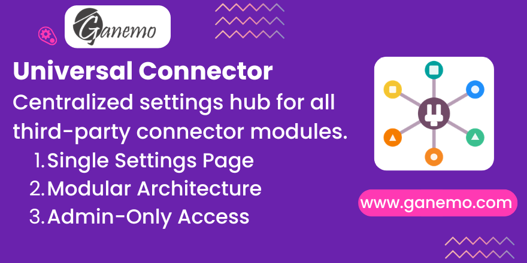

# **Universal Connector**



## Overview

Universal Connector is the foundation module for managing all third-party integrations in Odoo 19. It creates a dedicated **Connectors** application on the home screen with a unified Settings page where each connector module can register its credentials.

Instead of scattering API keys and tokens across different menus, Universal Connector provides **one organized place** to configure every integration.

## Key Features

- **Dedicated Connectors App** — A top-level application visible on the Odoo home screen, exclusively for integration management.
- **Unified Settings Page** — All connector credentials live on a single page under Connectors > Configuration > Settings.
- **Modular Architecture** — Each connector (OpenClaw, payment gateways, shipping providers, etc.) is a separate module that extends this hub via XPath.
- **Admin-Only Access** — The Connectors app and all credential configuration are restricted to the System Administration group (`base.group_system`).
- **Plug & Play** — Install a connector module, and its settings appear automatically. No manual view configuration needed.

## How It Works

Universal Connector provides:

1. **A `res.config.settings` extension** — The foundation model that connector modules inherit to add their own fields.
2. **A settings view with an `<app>` block** — Connector modules extend this view via XPath to insert their credential sections.
3. **Menu structure** — Connectors > Configuration > Settings, with the action scoped to the `universal_connector` context.

### For Developers: Building a Connector Module

To create a new connector that plugs into Universal Connector:

1. Add `universal_connector` to your module's `depends`.
2. Inherit `res.config.settings` and add your credential fields (e.g., `api_key`, `api_secret`).
3. Extend the settings view via XPath targeting the `universal_connector_block`:

```xml
<record id="res_config_settings_view_form_your_connector" model="ir.ui.view">
    <field name="name">res.config.settings.view.form.your.connector</field>
    <field name="model">res.config.settings</field>
    <field name="inherit_id" ref="universal_connector.res_config_settings_view_form_connector"/>
    <field name="arch" type="xml">
        <xpath expr="//block[@name='universal_connector_block']" position="after">
            <block title="Your Connector" name="your_connector_block">
                <setting string="API Key">
                    <field name="your_api_key"/>
                </setting>
            </block>
        </xpath>
    </field>
</record>
```

Your fields will appear automatically in the Connectors settings page.

## Installation

1. Install **Universal Connector** from the Apps menu.
2. The **Connectors** app appears on the home screen.
3. Install any connector module (e.g., OpenClaw Connector) — its settings appear automatically.

## Configuration

Navigate to **Connectors > Configuration > Settings** to view and configure all installed connector credentials. Only System Administrators can access this page.

## Compatibility

| Platform | Supported |
|---|---|
| Odoo.SH | Yes |
| Ganemo Online / Ganemo.SH | Yes |
| On-premise (Enterprise) | Yes |
| Odoo Online | No (custom code restrictions) |
| Multi-company | Yes |

## Dependencies

- `base_setup`

## License

OPL-1 (Odoo Proprietary License v1.0)

**Author**: [Ganemo](https://www.ganemo.com)
