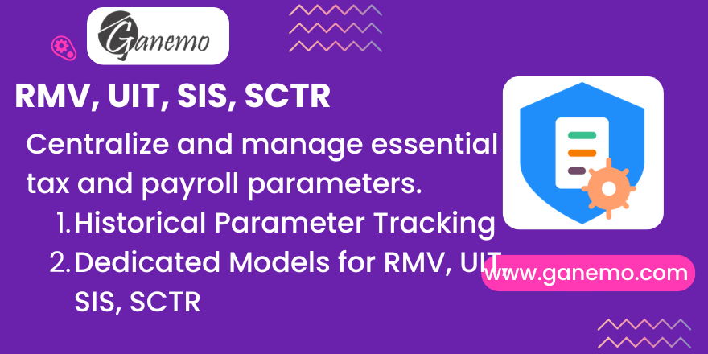

# **Various Data (RMV, UIT, SIS, SCTR)**

**Author**: [Ganemo](https://www.ganemo.com)

## Description

This module provides functionalities for the creation, updating, and historical monitoring of specific models related to essential tax and payroll parameters in Peru: `Minimum Vital Remuneration (RMV)`, `Unidad Impositiva Tributaria (UIT)`, `Seguro Integral de Salud (SIS)`, and `Seguro Complementario de Trabajo de Riesgo (SCTR)`.

Instead of hardcoding global parameters or constants in rules, this provides dedicated menus for HR analysts to define exactly what the parameters should be for different periods, making payroll calculations accurate and robust.

## Usage

1. Go to **Payroll > Configuration > Parameters** to access the models.
2. Select the parameter model you wish to update (`Minimum Vital Remuneration`, `UIT`, `SIS`, `SCTR`).
3. Click `New` to add a new parameter value.
4. Input the new amount, percentage or indicator, and define the validity window with `Start Date` and `End Date`.

These values can then be read by your customized payroll rules by checking the date ranges against the payslip period dates.

## Support

If you have purchased this module and need assistance, please refer to our Help Desk via [support@ganemo.com](mailto:support@ganemo.com).