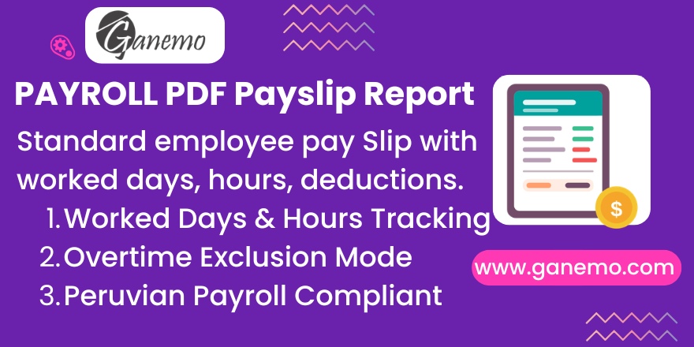

# **Voucher Payroll**

**Author**: [Ganemo](https://www.ganemo.co)

---

## Overview

**Voucher Payroll** is an Odoo 19 module that generates structured, professional employee pay slip vouchers. It is designed for Peruvian payroll compliance and integrates seamlessly with the `hr_payroll`, `voucher_sending`, `holiday_field_payroll`, and `types_system_pension` modules.

The module produces a multi-column pay slip that classifies worked days, computes hour types (regular, nocturnal, overtime), and presents salary lines in a clear three-column layout (Earnings / Deductions / Others) with net pay totals.

---

## Features

- **Standard Pay Slip Generation**: Produces vouchers from `hr.payslip` records with full salary line details.
- **Worked Day Classification**: Automatically categorizes each worked-day entry into:
  - Work Days
  - Vacation / Holiday Days
  - Break Days
  - Sanctioned Days
  - Non-working / Subsidy Days
  - Medical Rest Days
- **Multi-Hour Type Tracking**: Computes and displays:
  - Regular worked hours
  - Nocturnal hours (from `HNT_001`, `HNF_001`, or `WORKN × hours_per_day`)
  - Compensatory hours (code `27`)
  - Overtime at 25% (`HE_025`, `HEA_025`, `HEAF_025`, `HEF_025`)
  - Overtime at 35% (`HE_035`, `HEA_035`, `HEAF_035`, `HEF_035`)
  - Overtime at 100% (`HE_100`)
- **Overtime Exclusion Mode**: Employees with the `hiden_overtime` flag enabled will have their printed vouchers filtered to exclude all overtime-coded worked-day entries.
- **3-Column Layout**: Salary lines are organized by `invoice_position` (`pos_1`, `pos_2`, `pos_3`) for the Earnings / Deductions / Others columns, with automatic row balancing via padding.
- **Period & Week Display**: The pay period header includes the date range and ISO week numbers (e.g., `01 | 02 | 03`).
- **Termination Date**: If the employee's service termination date falls within the payslip's period month, it is shown on the voucher.
- **Employer Signature**: The authorized employer signature is fetched per company via `get_employer_sign`.
- **Multi-language**: English and Spanish translations included.

---

## Dependencies

| Module | Purpose |
|---|---|
| `voucher_sending` | Distribution pipeline (email / WhatsApp) |
| `employee_service` | Employee service date and employer sign |
| `absence_day` | Absence day computation |
| `additional_fields_voucher` | Additional voucher fields |
| `holiday_field_payroll` | Holiday detection and payroll integration |
| `types_system_pension` | Pension system type integration |

---

## Configuration

### 1. Work Entry Type Codes

Go to **Payroll → Configuration → Work Entry Types** and ensure each type is assigned the correct **Type Input** code:

| Code | Meaning |
|---|---|
| `work` | Regular worked day |
| `holidays` | Vacation / holiday day |
| `break` | Break / rest day |
| `sanctioned` | Sanctioned / disciplinary day |
| `not_working` | Non-working subsidy day |
| `subsidies` | Subsidy day |
| `medical_rest` | Medical rest day |

### 2. Resource Calendar

Open each **Employee** record → **Work Information** tab. Verify that the assigned **Resource Calendar** has the correct `Hours per Day` value. This is used to compute nocturnal hours from `WORKN` input codes.

### 3. Hide Overtime Flag

To exclude overtime entries from a specific employee's printed voucher:

1. Open the employee form.
2. Navigate to the **Payroll** tab.
3. Enable **Hide Overtime** (`hiden_overtime`).

When enabled, only `WORK1`-coded entries that do **not** contain any of the overtime codes (`HNT_001`, `WORKN`, `27`, `HE_100`, `HE_035`, `HEA_035`, `HE_025`, `HEA_025`) will appear in the worked hours section.

### 4. Salary Rule Categories — 3-Column Layout

For the pay slip to display correctly in 3 columns, each salary rule's category must have the `invoice_position` field set to one of:

| Value | Column |
|---|---|
| `pos_1` | Earnings (left) |
| `pos_2` | Deductions (center) |
| `pos_3` | Others (right) |

Only rules with `appears_on_payslip = True` are included in the layout and in the net total calculation.

---

## Usage

### Generating a Voucher

1. Go to **Payroll → Payslips**.
2. Create or open a payslip for the target employee and period.
3. Click **Compute Sheet** to calculate all salary lines and worked-day categories.
4. Use the **Print** action (or the Voucher Sending integration) to generate and distribute the PDF pay slip.

### Understanding the Report Data

The report engine (`ReportVoucherPayroll`) provides two data structures:

- **`cat_lines`**: Three categorized lists of salary lines (`cat_1`, `cat_2`, `cat_3`) with their totals and the overall net (`total_net`).
- **`calc_data`**: Per-payslip summary of the period string, ISO week numbers, worked/vacation/medical days, and all hour type totals.

---

## Technical Reference

| Model / Class | Description |
|---|---|
| `report.voucher_payroll.report_payslip_voucher_payroll_l10n_pe` | Abstract model backing the QWeb PDF report |
| `find_weeks(start, end)` | Static method that computes ISO week numbers for the given date range |
| `_get_calc_data(payslips)` | Computes the per-payslip day/hour summary dictionary |
| `_get_structure_report(payslips)` | Builds the 3-column salary line structure |
| `filter_per_category(payslip, category)` | Filters salary lines by `invoice_position` |

---

## Compatibility

| Platform | Supported |
|---|---|
| Odoo 19 Enterprise | ✅ Yes |
| Odoo.SH | ✅ Yes |
| Ganemo Online / Ganemo.SH | ✅ Yes |
| Odoo Online (SaaS) | ❌ No (custom code restriction) |

---

## License

This module is licensed under the **Odoo Proprietary License v1.0 (OPL-1)**. See `LICENSE.txt` for full terms.

---

## Support

| Channel | Contact |
|---|---|
| 💬 WhatsApp | [+1 (828) 672-6150](https://wa.me/18286726150) |
| 📧 Sales | [leads@ganemo.com](mailto:leads@ganemo.com) |
| 🎯 Book Demo | [ganemo.co/appointment/5](https://www.ganemo.co/appointment/5) |
| 🛠 Help Desk | [help@ganemo.com](mailto:help@ganemo.com) |
