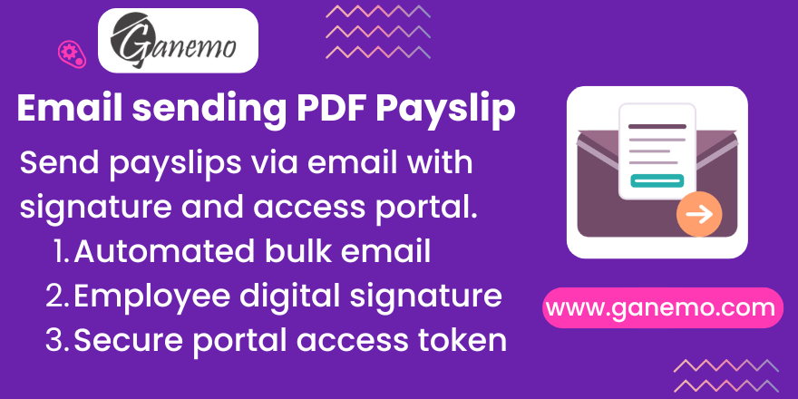

# **Voucher Sending**

## Overview

**Voucher Sending** automates the distribution of employee payslips directly from Odoo HR Payroll. With a single click, HR administrators can dispatch payslips in bulk to employees via email. Each email contains a **secure, tokenized portal link** that allows the employee to view and digitally sign their payslip—without requiring an Odoo user account.

## Key Features

- **Bulk Email Dispatch**: Select one or multiple confirmed payslips and send them all with a single action. The module validates that each employee has a configured Work Email before sending.
- **Auto PDF Generation**: If a payslip PDF attachment does not yet exist, the module automatically generates it using the payslip structure's configured report template before sending.
- **Secure Portal Access**: Each email contains a unique, access-token-secured link. Only the intended recipient can open the portal page. No Odoo login is required.
- **Digital Employee Signature**: On the portal page, the employee can sign the payslip digitally using a signature pad. The signature is stored on the payslip record and the status changes from *To Sign* to *Signed*.
- **Auditable Acknowledgment**: The combination of the sent email log and the stored signature image provides a complete, auditable trail of payslip delivery and acknowledgment.
- **Multi-language Support**: Fully translated into English and Spanish (es, es_PE, es_MX).

## Technical Details

| Component | Description |
|-----------|-------------|
| **Model** | `hr.payslip` (extended) |
| **Mixins** | `portal.mixin` |
| **New Fields** | `employee_mail`, `status`, `signature`, `display_name` |
| **Key Methods** | `action_send_mail_employees()`, `generate_report_manually()` |
| **Portal URL** | `/my/payslip/<id>?access_token=<token>` |
| **Depends** | `hr_payroll`, `portal`, `mail`, `web` |

## Installation

1. Install the module from the Odoo Apps list.
2. Ensure the outgoing mail server is configured in **Settings > Technical > Outgoing Mail Servers**.
3. Verify that each employee has a **Work Email** set on their employee record.

## Configuration

No special configuration is required after installation. The module extends the standard `hr.payslip` model automatically.

### Verify Employee Emails

1. Go to **Employees > Employees**.
2. Open each employee record.
3. Ensure the **Work Email** field (General tab) is filled in.
4. Optionally, fill in the **Private Email** (Private Information tab) for portal notifications.

## Usage

### Sending Payslips by Email

1. Go to **Payroll > Payslips** (or **Payroll > Payslip Batches**).
2. Select one or more payslips in **Done** or **Paid** state.
3. Click **Action > Send Payslip Email**.
4. The system will:
   - Validate that all selected employees have a Work Email.
   - Generate missing PDF attachments automatically.
   - Send an individual email to each employee with the payslip PDF and a secure portal link.

> **Note**: Only payslips in *Done* or *Paid* state are processed. Draft payslips are automatically excluded.

### Employee Portal Experience

1. The employee receives an email with the payslip PDF attached.
2. The email also contains a **"View Payslip"** button with a secure link.
3. Clicking the link opens the payslip portal page (no login required).
4. The employee can review the payslip details and submit a **digital signature**.
5. Once signed, the payslip status updates to **Signed** in the backend.

## Fields Reference

| Field | Label | Description |
|-------|-------|-------------|
| `employee_mail` | Employee Email | Private email of the employee (read-only, from employee record). Used for portal access notifications. |
| `status` | Signature Status | `To Sign` (default) or `Signed`. Updated when the employee signs via the portal. |
| `signature` | Employee Signature | Digital signature image (128x128px) submitted by the employee through the portal. Stored as an attachment. |

## Troubleshooting

| Problem | Cause | Solution |
|---------|-------|----------|
| Employee did not receive email | Work Email not configured | Set the Work Email on the employee record. Check outgoing mail server in Settings. |
| Only some payslips were sent | Payslips in Draft state were skipped | Confirm payslips first (set to Done). Only Done/Paid payslips are sent. |
| Portal link shows "Access Denied" | Token expired or invalid | Resend the payslip email to generate a new secure token link. |
| PDF not generated | Report template not configured on payslip structure | Assign a report to the payslip structure, or the default `hr_payroll.action_report_payslip` will be used. |

## Compatibility

- **Odoo Version**: 19.0
- **Edition**: Enterprise (Odoo.SH, Ganemo Online, Ganemo.SH)
- **NOT compatible** with Odoo Online (Community) due to custom code restrictions.

## Credits

**Author**: [Ganemo](https://www.ganemo.co)
**Maintainer**: [Ganemo](https://www.ganemo.co)
**License**: OPL-1 (Odoo Proprietary License v1.0)

For commercial inquiries: [leads@ganemo.com](mailto:leads@ganemo.com)
For technical support: [help@ganemo.com](mailto:help@ganemo.com)
WhatsApp: +1 (828) 672-6150
