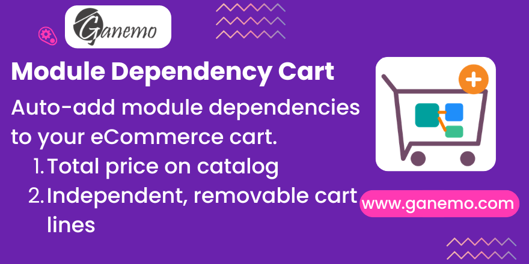

# **Website Sale Module Dependency**



## Overview

This module replicates the Odoo App Store dependency experience for your own eCommerce store. When a customer adds an Odoo module to their cart, all required dependencies are automatically added as separate, removable cart lines. The catalog and product pages display the total investment including all dependencies.

## Features

- **Recursive Dependency Resolution** — If Module A depends on B, and B depends on C, adding A adds both B and C automatically.
- **Cycle Protection** — Circular dependency chains (A→B→C→A) are handled safely without infinite loops.
- **Independent Cart Lines** — Each dependency is a separate line item. Customers can remove dependencies they already own.
- **No Duplicate Detection** — If a dependency is already in the cart, it won't be added again.
- **Total Price Display on Catalog** — The `/shop` page shows "Total with dependencies" below the module price.
- **Dependency Breakdown on Product Page** — Lists every dependency with its individual price and a highlighted total.
- **Unpublished Dependency Protection** — Dependencies not published on the website show a 🔒 lock icon and "Not available" label. Their price is still visible and counted in the total, but they are NOT auto-added to the cart.
- **Backend "Add Dependencies" Button** — Salespeople can one-click add all missing module dependencies to any draft/sent quotation. Variant-aware, recursive, with notification summary.
- **Variant-Aware Resolution** — When modules have version variants (e.g., 17.0, 18.0), the system matches the correct dependency variant based on shared attributes.
- **Auto-Cleanup on Removal** — When a parent module is removed from the cart, its orphan dependency lines are cleaned up (unless still needed by another module).
- **Zero Impact on Regular Products** — All logic is gated behind the `Is Odoo Module` boolean field. Non-module products behave exactly as before.

## Configuration

### Step 1: Mark Products as Modules

1. Go to **Sales > Products > Products**.
2. Open a product and check the **"Is Odoo Module"** checkbox.
3. A new tab **"Module Dependencies"** appears.

### Step 2: Add Dependencies

1. In the **Module Dependencies** tab, use the tags widget to add other module products.
2. Only products marked as "Is Odoo Module" appear in the selector.
3. The **Total Price (with Dependencies)** and **Dependency Count** fields update automatically.

### Step 3: Publish to Website

1. Publish the module products on your website.
2. The catalog (`/shop`) will automatically show "Total with dependencies" for modules with dependencies.
3. The product detail page shows a full dependency breakdown with individual prices.

## How It Works

### Cart Behavior

When a customer clicks "Add to Cart" on a module:

1. The module is added to the cart (standard behavior).
2. The system resolves all recursive dependencies.
3. For each **published** dependency NOT already in the cart, a new cart line (qty=1) is created.
4. **Unpublished** dependencies are silently skipped (they appear in the UI with a lock icon but are NOT added to the cart).
5. The customer sees all items as separate lines and can remove any of them.

### Unpublished Dependencies

| Frontend (Customer) | Backend (Salesperson) |
|---|---|
| Shown with 🔒 lock icon + "Not available" label | Fully available via "Add Dependencies" button |
| Price visible and counted in total | All deps added, including unpublished |
| NOT auto-added to cart | ⚠ Warning shown for unpublished items |

### Backend: Add Dependencies to Quotations

1. Create or open a quotation in **Sales > Orders > Quotations**.
2. Add module products as order lines.
3. Click **"🧩 Add Dependencies"** below the order lines.
4. All missing recursive dependencies are added as new lines (variant-matched).
5. A notification toast summarizes what was added (with ⚠ for unpublished items).
6. Click again → "All dependencies are already satisfied. ✓"

### Price Display

| Location | What's Shown |
|---|---|
| **Catalog** (`/shop`) | Module price + "Total with dependencies: $X.XX" |
| **Product Page** | Base price + dependency list with individual prices + total |
| **Cart** | Each module/dependency as a separate line with its own price |

### Technical Details

- **Override Points**: `sale.order._cart_update()` for frontend auto-add; `sale.order.action_add_dependencies()` for backend button.
- **Data Model**: `product.template` extended with `is_odoo_module` (Boolean), `dependency_ids` (Many2many reflexive to `product.template`), `all_dependency_ids` (Many2many stored, recursive), `total_price_with_deps` (computed Float), `dependency_count` (computed Integer), `published_dependency_ids` / `published_dependency_count` (computed, for frontend templates).
- **Recursive Helper**: `_get_all_dependencies(visited=None)` — traverses the dependency tree using a `visited` set for cycle detection.
- **Variant Matching**: `_find_matching_dep_variant(source_product, dep_template)` — scores variants by attribute value overlap.
- **QWeb Templates**: Inherits `website_sale.products_item` and `website_sale.product` via XPath.
- **Backend View**: Inherits `sale.view_order_form` — button in `so_button_below_order_lines` div.

## Compatibility

| Environment | Supported |
|---|---|
| Odoo Enterprise 18.0 | ✅ |
| Odoo.SH | ✅ |
| Ganemo Online | ✅ |
| Odoo Online (Odoo.com) | ❌ (custom code not allowed) |

## Dependencies

- `website_sale`

## FAQ

**Q: Does this affect normal (non-module) products?**
A: No. All logic is gated behind the `Is Odoo Module` boolean. If unchecked (default), the product flows through standard cart logic.

**Q: What happens with circular dependencies?**
A: The system uses cycle detection. Even if A→B→C→A creates a loop, the resolver stops after visiting each module once.

**Q: Can customers remove auto-added dependencies?**
A: Yes. Each dependency is an independent cart line and can be removed freely.

**Q: What happens with unpublished dependencies?**
A: They are shown in the dependency list with a 🔒 lock icon and "Not available" label. Their price is still visible and counted in the total, but they are NOT added to the customer's cart. In the backend, salespeople CAN add them via the "Add Dependencies" button.

**Q: Can I add dependencies from the backend?**
A: Yes! Use the "🧩 Add Dependencies" button on any draft/sent quotation. It resolves recursive dependencies, matches variants, and shows a summary notification.

## Tests

The module includes automated tests covering:

- Recursive dependency resolution (simple, chained, no deps)
- Cycle protection (constraint + traversal)
- Total price computation
- Cart auto-add behavior (published deps only)
- No duplicate prevention
- Regular product non-interference
- Orphan dependency cleanup on removal
- Shared dependency preservation
- Variant matching (same version, fallback, no-variant)

Run tests with:
```bash
python odoo-bin --test-tags /website_sale_module_dependency -d your_database
```

## License

OPL-1

**Author**: [Ganemo](https://www.ganemo.co)
