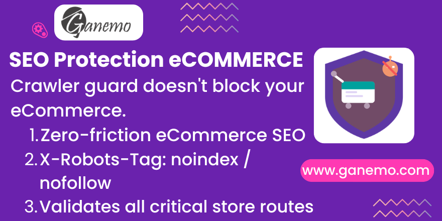

# **Website SEO Protection: eCommerce**

## Overview

`website_seo_protection_ecommerce` is a lightweight companion module that ensures the **SEO crawler protection guard** (`website_seo_protection`) never inadvertently blocks your Odoo eCommerce store routes.

It auto-installs silently when both `website_seo_protection` and `website_sale` are present in your environment — requiring zero configuration from the administrator.

---

## Purpose

The core SEO protection module defends your Odoo server from crawler trap attacks by blocking excessive bot-generated URL patterns. However, an overly aggressive guard could accidentally interfere with legitimate eCommerce paths such as product pages, the shopping cart, or the checkout flow.

This module solves that concern by providing an automated test suite that proves the guard and the eCommerce routes coexist correctly.

---

## What It Validates

The test suite covers all critical `website_sale` routes:

| Route | Description |
|---|---|
| `/shop` | Main product catalog |
| `/shop?page=N` | Paginated shop pages |
| `/shop/product-slug` | Individual product detail pages |
| `/shop?category=N` | Product category filters |
| `/shop/cart` | Shopping cart |
| `/shop/checkout` | Checkout page |
| Payment confirmation pages | Post-purchase success pages |

All of the above routes **must return accessible responses** (200 or appropriate redirect), never a 403 or crawler-trap block.

---

## Installation

### Automatic (Recommended)

This module uses `auto_install: True`. It will activate automatically as soon as:

1. `website_seo_protection` is installed.
2. `website_sale` is installed.

No manual action required.

### Manual

If needed, go to **Apps → Search for "Website SEO Protection: eCommerce"** and click **Install**.

---

## Configuration

No configuration required. This module has no settings, views, or menus. It is a pure technical companion containing only test cases.

---

## FAQ

**Q: Does this module add any new UI or settings?**
No. It only contains automated tests that validate route compatibility.

**Q: What if the module didn't auto-install?**
Ensure both `website_seo_protection` and `website_sale` are installed, then update your app list (Settings → Activate Developer Mode → Apps → Update App List).

**Q: My product page is returning 403 — is this module the cause?**
No. This module has no middleware or controllers. Check the `website_seo_protection` whitelist configuration to ensure `/shop/*` routes are explicitly whitelisted.

**Q: Is this compatible with multi-website setups?**
Yes. The underlying SEO guard and this companion respect Odoo's multi-website architecture.

---

## Technical Details

- **Module name**: `website_seo_protection_ecommerce`
- **Version**: 18.0.1.0.0
- **License**: OPL-1
- **Dependencies**: `website_seo_protection`, `website_sale`
- **Auto-install**: Yes (when both dependencies are present)
- **Models**: None
- **Views**: None
- **Tests**: `tests/test_ecommerce_seo.py`

---

## Support

| Channel | Contact |
|---|---|
| **Sales / Quotes** | [leads@ganemo.com](mailto:leads@ganemo.com) |
| **Technical Support** | [help@ganemo.com](mailto:help@ganemo.com) |
| **WhatsApp** | [+1 (828) 672-6150](https://wa.me/18286726150) |
| **Book a Demo** | [ganemo.co/appointment/5](https://www.ganemo.co/appointment/5) |

---

**Author**: [Ganemo](https://www.ganemo.com)
